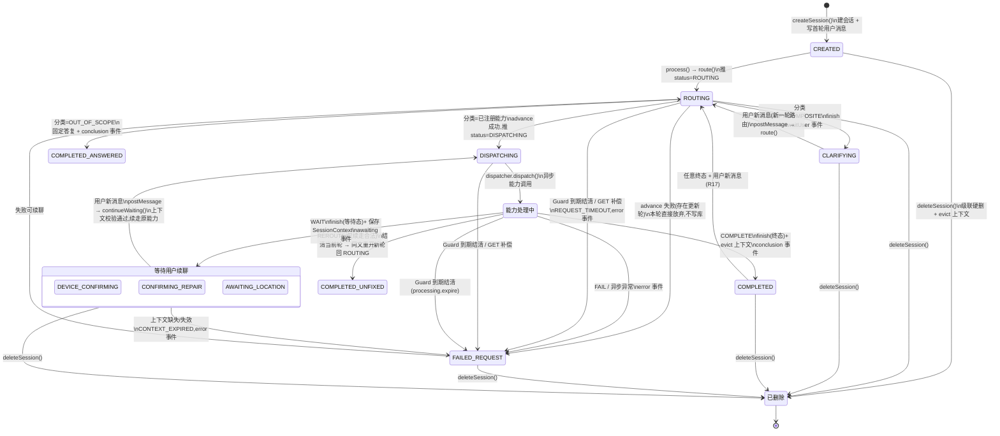

# SessionOrchestrator 状态机

> 历史档案：本文记录2026-09-08的旧实现，不是目标架构。2026-09-15起的迁移以[002实施计划](../specs/002-assistant-foundation/plan.md)及[graph契约](../specs/002-assistant-foundation/contracts/graph-contract.md)为准；移植完成后删除SessionOrchestrator及旧状态机/续接设计，本文仅供历史追溯。

**日期**: 2026-09-08
**来源**: `core/session/SessionOrchestrator.java` + `core/session/SessionProcessingService.java` + `domain/enums/SessionStatus.java`
**口径**: 本文描述**公共编排层实际驱动的状态迁移**;状态全集见 `SessionStatus`(data-model.md §3)。能力处理器(003/004/005)经 `CapabilityResult.status()` 选择的中间态/终态在图中归并为占位节点。

---

## 1. 状态分组

| 分组 | 状态 | 说明 |
| --- | --- | --- |
| 入口 | `CREATED` | 会话建行后的初始状态(仅 create 路径) |
| 公共路由 | `ROUTING` → `DISPATCHING` | 编排层直接推进;AI 分类 + 服务端校验 |
| 等待用户 | `CLARIFYING`、`DEVICE_CONFIRMING`、`CONFIRMING_REPAIR`、`AWAITING_LOCATION` | `isAwaitingUser()`;`finish` 允许的目标态 |
| 能力驱动中间态 | `ANALYZING`、`DIAGNOSING`、`PLANNING`、`LOCATING`、`AFTERSALES_LOOKUP`、`ANSWERING`、`REPAIRING`、`VERIFYING` 等 | 由能力结果/流事件呈现,编排层不主动设置 |
| 终态 | `COMPLETED_ANSWERED`、`COMPLETED_FIXED`、`COMPLETED_UNFIXED`、`GUIDED_MANUAL`、`GUIDED_AFTERSALES`、`COMPLETED_AFTERSALES`、`REJECTED_*`、`FAILED_*`、`FAILED_REQUEST` | `isTerminal()`;任意终态可经用户新消息回到 `ROUTING`(R17) |

---

## 2. 状态机图(Mermaid)

> 注:`COMPLETED` 为全部终态的占位(`COMPLETED_*`、`GUIDED_*`、`REJECTED_*` 等);`能力处理中` 为能力驱动的中间态占位。处理中(`processing_message_id` 非空且未过截止)的会话**不可删除**,删除请求以 409 `SESSION_BUSY` 拒绝,状态不变。

---

## 3. 迁移触发表(编排层视角)

| # | 迁移 | 触发点 | 落库/推流 |
| --- | --- | --- | --- |
| T1 | `*` → `CREATED` | `processing.create` | 建行 + 首轮 USER 消息 |
| T2 | `CREATED`/等待态/终态 → `ROUTING` | `process → route`(新轮) | 推 `status=ROUTING` |
| T3 | `ROUTING` → `CLARIFYING` | 分类 CLARIFY/COMPOSITE | `advance` 记录意图;`finish` + `awaitUser` |
| T4 | `ROUTING` → `COMPLETED_ANSWERED` | 分类 OUT_OF_SCOPE | 固定答复;`finish` + `conclusion` |
| T5 | `ROUTING` → `DISPATCHING` | 分类命中已注册能力 | `advance` 成功才推 `status=DISPATCHING` 并分发 |
| T6 | `DISPATCHING` → 终态 | `settle: COMPLETE` | `finish` 成功才 evict 上下文 + `conclusion`;false=迟到回调只记日志 |
| T7 | `DISPATCHING` → 等待态 | `settle: WAIT` | `finish` 成功才保存 `SessionContext` + `awaiting` |
| T8 | `DISPATCHING` → `FAILED_REQUEST` | `settle: FAIL`/异常 | `failAccepted`:落库与否都推 `error` |
| T9 | `DISPATCHING` → `COMPLETED_UNFIXED` → `ROUTING` | `settle: REROUTE`(仅续走) | 结清当前轮,同文 `accept` 重开新轮;非续走来源按内部错误收尾 |
| T10 | 等待态 → `DISPATCHING` | `continueWaiting` 上下文校验通过 | 续走原能力(带 waitingState) |
| T11 | 等待态 → `FAILED_REQUEST` | 上下文缺失/轮次不符 | `CONTEXT_EXPIRED` + `error` |
| T12 | 处理中 → `FAILED_REQUEST` | Guard `expireSafely` / `recoverOwned` 补偿 | `REQUEST_TIMEOUT`;DB 未过截止(时钟偏差)1 秒后重试 |
| T13 | 非忙 → 已删除 | `deleteSession` | 单事务级联删除 4 子表 + 会话行,evict Redis 上下文;忙则 409 |

---

## 4. 不变量与守卫

- **指针权威**:所有收尾经 `processing.finish/advance` 指针校验(`session_id + message_id + round`);迟到回调返回 false,只记 `Stale callback ignored`,不改库不推流。
- **忙守卫**:同会话处理中再发消息 → 409 `SESSION_BUSY`,不新增消息;删除同理。
- **租约**:Guard 持有 owner 租约按 `sessionRenewSeconds` 续期;失租约后 `sink()` 丢弃后续 token,DB 指针仍为准。
- **固定截止**:到期 `expire` 结清为 `FAILED_REQUEST`;时钟偏差或异常 1 秒后重试,保证最终结清。
- **终态回路(R17)**:任意终态/等待态均可经用户新消息继续;`CLARIFYING` 走全新路由,其余等待态续走原能力。
- **零设备写授权**:公共路由只分发到已注册能力;AI 输出不构成设备写授权,缺失能力明确失败(`FAILED_REQUEST`)。
