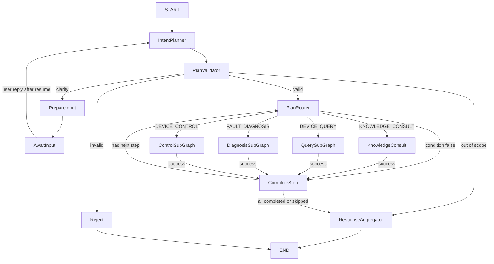

# Implementation Plan: LangGraph4j 多步对话工作流

**Branch**: `dev`（实际Git分支） | **Feature**: `002-assistant-foundation`（Spec Kit入口） | **Date**: 2026-09-15 | **Spec**: [spec.md](spec.md)
**Status**: 83项新任务已全部实施并验收，见[tasks](tasks.md)及[本期验证](validation-langgraph.md)：默认205项、完整含IT 257项通过，独立JVM三组恢复、最终JAR/12个prompt和前端验收通过。旧59项完成记录按原字节保存在[历史快照](history/20260915-before-langgraph-tasks.md)，原[validation](validation.md)仅为旧版证据。业务数据库迁移未自动执行。
**Input**: 已确认的五项澄清，以及用户指定的 State、MainGraph、requestId/threadId、state → WorkflowEvent → SSE、子图与 stub 优先要求。
**本轮修订**: LangGraph4j移植完成时必须删除SessionOrchestrator及旧编排设计；不能以保留精简门面、开关回退或仅停止注入作为完成标准。
**持久化修订**: 按conversation、chat_message、workflow_execution、command_execution、audit_event五类逻辑数据组织；复用repair_session、chat_message、repair_action_log，只补充工作流/命令及必要内部结构，取代上版独立workflow_event新表方案。

## 2026-09-21：004基础事实回答与查询契约更新

004的[计划](../004-user-device-query/plan.md)与[任务](../004-user-device-query/tasks.md)负责以下增量，不计入002旧83项完成记录：LoadUserDevices固定初始化→Planner；已有基础事实足够时沿用KNOWLEDGE_CONSULT直接回答（requiresKnowledgeBase=false、answerMode=DEVICE_CONTEXT），不生成DEVICE_QUERY/list/metadata。DirectAnswerService通过资源模板接收已保存事实，复用工厂/缓存/stream，身份归属重验，不额外查设备或检索。运行属性确认范围为完整GET快照及能力hash；型号结构化对象及动态字段/前序引用替代固定清单，MOCK只展示，不参与真实控制条件。具体任务与验收以004为准，下文描述原002交付基线。

## Summary

以 LangGraph4j 重写会话响应编排。MainGraph 负责规划、验证、确定性路由、步骤完成和最终汇总；KnowledgeConsult 复用知识能力，Query/Diagnosis/Control 通过独立子图接入。Controller 消费 graph.stream 的中间 State 中 OutputContext，投影为 WorkflowEvent，再发送 SSE；AI 回调不直接推送 SSE。
先以 stub 跑通四类能力、多步条件、确认、失败、重试及恢复，然后接入已有知识实现和领域能力。保留账号、设备绑定、DTO、共享内存知识索引、用户 AI 缓存和历史记录。
使用未编译 StateGraph 子图，在主图编译时内联，共享一个 requestId/threadId、state 和 saver。图中步骤回边只用于遍历既定计划，不能让 LLM 生成循环或执行中增删步骤。
最终运行结构只保留LangGraph4j对步骤、等待和续接的控制权。接纳、事务、鉴权、租约、历史查询等公共职责按下文迁移后，删除旧编排类及其专属协作者；共享能力与历史数据继续保留。

## Technical Context

**Language/Version**: Java 21，无 preview；Spring Boot 3.5.3。
**Primary Dependencies**: 新增 org.bsc.langgraph4j:langgraph4j-core:1.8.27；保留 LangChain4j 1.0.1、community 1.0.1-beta6、MyBatis-Flex 1.10.9、Spring MVC/Security、SLF4J/Log4j 2。仅用 core，不引 langgraph4j-langchain4j starter/集成模块，不升级模型 SDK。
**Storage**: MySQL承载五类逻辑数据：conversation→repair_session、chat_message→原表、workflow_execution→新表及step/approval/checkpoint内部表、command_execution→新命令账本、audit_event→扩展repair_action_log；不新建workflow_event或平行conversation/audit表。problem_report/diagnostic_snapshot保留领域用途；Redis TTL租约和token保留。Caffeine userId AI代理缓存及启动共享InMemoryEmbeddingStore沿用003已获用户授权的范围。
**Testing**: JUnit5/AssertJ/Mockito、MockMvc、WireMock、Testcontainers；新增 graph 骨架测试、真实 AI 代理契约测试、MySQL saver/重启集成测试。前端增量适配后执行 build 和手动路由检查。
**Target Platform**: 现有 Windows/Linux JVM 后端，单仓库 Vue 客户端。
**Project Type**: Web 服务；本次产物为设计文档，不创建生产类或执行数据库迁移。
**Performance Goals**: 默认最多8步；LLM planner 30秒；知识/诊断步骤每次60秒；设备查询/控制每次10秒；超时最多额外重试2次、间隔1秒。确认有效期300秒；昂贵步骤阈值30秒；活跃执行区间300秒，不含人工等待/重启等待。这些为可配置工程预算，不宣称已测生产 SLA。
**Constraints**: 模型只产候选；每次设备请求须有对应有效确认并重查权限；明确错误/拒绝不重试；失败或耗尽停止整计划。控制结果未知且无远端去重保障时禁止重发。重启后只由用户明确请求继续。
**Scale/Scope**: 五feature协作、四类步骤、单会话一个未终止计划，不引入并行步骤、动态计划编辑、通用脚本或新设备模拟器。

## Constitution Check

| 门禁 | Phase 0 前 | Phase 1 后 |
| --- | --- | --- |
| Java21 / Boot3.5.3 | 保持现有基线 | 设计通过；core要求Java17+，依赖树/实际编译留到骨架验收 |
| MySQL / MyBatis-Flex | 持久检查点不能放Redis | 通过；自定义 BaseCheckpointSaver 经服务和 mapper 落MySQL |
| LangChain4j / prompt资源化 | LangGraph负责编排，不替代AI框架 | 通过；专用AI工厂和fromResource保留 |
| 配置外部化 / 密钥 | 新预算须可配置 | 通过；仅写默认值，连接/凭据沿用环境注入 |
| Controller分层 | Controller可消费stream，但不执行业务校验/事务 | 通过；core/session负责接纳/批准/恢复，Controller仅投影与传输 |
| graph目录 | 章程原列举core编排 | 已授权偏离：用户明确选Java基包根目录graph，与core同级；不新增源码根或第二套业务服务 |
| Entity/DTO | 复用现有风格 | 通过；Entity Getter/Setter，State context/DTO优先record |
| 日志与审计 | 不能把state或完整对话写日志 | 通过；白名单关联与持久审计分开，条件日志格式保留 |
| Caffeine与内存向量库 | 章程缓存主选Redis | 沿用用户已指定且003已实现的有限例外，不扩展为持久工作流存储 |
| 最小实现 / stub | 新编排框架有明确需求 | 通过；只加core，一个共享状态模型，先stub验证，再复用真实能力 |
| 变更与验证 | 旧tasks已完成不代表新设计实现 | 通过；保留历史证据，任务重生成后才实施 |
| 旧编排彻底退出 | 旧编排及专属机制已删除 | G5按矩阵核对源码、Bean、配置和测试；禁止永久双链或改名复制旧编排，验证见validation-langgraph.md |
| 持久化复用与职责分离 | 既有会话/消息/动作日志可复用，尚无命令幂等账本 | 通过；扩展三张旧表，新增工作流/命令及三张必要辅助表；事件追加与命令状态分开，不改写历史或重复建审计表 |

门禁是设计评估，不是构建/重启实验已经通过。外部控制接口缺少幂等支持已形成禁止不安全重发的确定性策略，无需把风险留给模型自行判断。

## Project Structure

### Documentation (this feature)

```text
specs/002-assistant-foundation/
├── spec.md
├── plan.md
├── research.md
├── data-model.md
├── quickstart.md
├── tasks.md                         # 本期83项待实施任务
├── history/20260915-before-langgraph-tasks.md # 旧59项原字节快照
├── validation.md                    # 历史验证，不改写为本期成功
└── contracts/
    ├── graph-contract.md
    ├── routing-contract.md
    ├── assistant-api.md
    ├── prompt-contract.md
    ├── logging-contract.md
    └── user-device-api.md
```

### Source Code (repository root)

下列为实施目标，不表示目录或类已经创建。用户已确认 graph 位于 Java 基包，不是 AutoSense/graph。

```text
src/main/java/com/chh/autosense/
├── graph/
│   ├── MainGraphFactory.java
│   ├── state/                       # AssistantState、九个context及类型化计划/结果
│   ├── node/                        # Planner、Validator、Router、CompleteStep、
│   │                                # Aggregator、Reject；共享失败/重试/流适配
│   ├── subgraph/
│   │   ├── QuerySubGraphFactory.java
│   │   ├── DiagnosisSubGraphFactory.java
│   │   └── ControlSubGraphFactory.java
│   └── checkpoint/                  # MyBatisCheckpointSaver、版本化serializer
├── controller/                      # SessionController，读取graph stream输出
├── core/session/                    # WorkflowExecutionService、会话查询/事务、租约；无旧Orchestrator/状态机
│   └── memory/                      # 复用HistoryService，增加请求级ChatMemory适配
├── core/device/                     # 已有归属、client、adapter、锁
├── service/device/                  # 复用DeviceRegistryService，不另建注册服务
├── service/knowledge/               # 复用UserAiServiceCache；抽取旧handler的知识业务，旧分发契约删除
├── ai/factory/                      # 新IntentPlannerServiceFactory；复用其他工厂
├── ai/model/                        # 模型候选计划，不放可信授权
├── config/                          # GraphProperties与装配
├── mapper/                          # 复用会话/消息/审计mapper，新增workflow/command映射
└── domain/
    ├── entity/                      # 复用RepairSession/ChatMessage/RepairActionLog，新增workflow/command实体
    ├── dto/                         # approval/resume/cancel请求
    ├── enums/                       # 业务步骤/状态
    ├── message/                     # WorkflowEvent与既有SSE
    └── vo/                          # WorkflowView
src/main/resources/prompt/           # 新intent-planner.txt，复用已有知识/诊断模板
scripts/migration/                   # 实施时新增20260915-langgraph-workflow.sql
src/test/java/com/chh/autosense/graph/
frontend/src/                       # 最小步骤、确认、恢复交互适配
```

**Structure Decision**: graph 只描述编排与框架适配；事务仍由core/session负责，mapper/entity不迁入graph。AI代理工厂仍在ai/factory。具体独立类按可复用职责创建，不为每个字段或节点强制增加Service/Impl双层。

## Phase 0: Research

[research.md](research.md) 固定了版本、内联子图、中断/恢复、stream adapter、saver SPI、请求身份、幂等限制、Memory与缓存的边界。关键结论：
1. core 1.8.27 足够；不借框架迁移升级现有LangChain4j。
2. 内联子图避免 compiled subgraph 派生不同threadId；批准恢复不重新运行Planner。
3. 中间 token snapshot 不等于持久检查点；最终结果先存储再发布成功。
4. 当前device client无远端幂等键/结果查询；UNKNOWN写操作必须停止，stub不能作为真实写安全证明。
5. repair_action_log已混合保存动作和状态事件，复用为audit_event；它缺少写前意图/幂等键，不能代替独立command_execution。保留旧表名与ID，无需复制历史数据。

## Phase 1: Design & Contracts

### MainGraph与状态

保留用户给定主图正常路径，增加失败/条件跳过所需的确定性边：



每个外部调用/子图的失败由统一guard写入失败state并路由Reject，不进入成功CompleteStep；Reject负责终止输出和标记剩余未执行，不能被当作可重试节点重新执行业务。中断是暂停而非END。正常路径图之外，CLARIFY经PrepareInput/AwaitInput中断后回Planner，OUT_OF_SCOPE经Aggregator正常结束；已定计划的参数澄清在子图内部补齐运行时绑定，不增删步骤。
九个context及messages共十个顶层键，完整字段见[data-model](data-model.md)。PlanContext.currentStep唯一驱动路由，WorkflowContext.currentStep是显示镜像，避免两个独立游标。

### 执行、安全与恢复

[graph-contract](contracts/graph-contract.md)定义Query确认门、Diagnosis证据消费、Control批准与写前意图、失败停止、检查点及有界重试。
`threadId=RequestContext.requestId`；同计划跨HTTP批准与resume保持原值，新HTTP trace另行关联。持久化按下述五类逻辑数据分工，业务结果/命令/审计与checkpoint通过幂等补齐处理提交间隙。
所有设备请求（含查询、复检）都走用户确认；复检是独立Query步骤，诊断或控制不隐式读取。本地绑定解析只取展示批准所需最小元数据，不探测设备。
重启后WAITING_RESUME只允许本人显式继续；旧会话GET超时补偿不能把新图状态自动判失败。已完成或已终止计划绝不恢复执行。

### Streaming与Memory

Controller 从LangGraph4j `NodeOutput.state()`读取OutputContext，纯投影到WorkflowEvent，同时兼容旧五类SSE；内部AgentState不向客户端暴露。
骨架先用节点级输出；真实TokenStream经core支持的嵌入AsyncGenerator桥接，callback只入队。中间token携带独立输出snapshot，最终Map更新才进入持久state。等待/终态在相应检查点/事务完成后关闭流。
请求级ChatMemory消费本人历史窗口，messages记录纯数据；AI代理保持userId缓存和无状态，避免同用户多会话串记忆。近期20条历史与本次输入只出现一次。

### 契约与迁移

- [assistant-api](contracts/assistant-api.md)：新WorkflowEvent、步骤GET、批准/resume/cancel及旧API桥。
- [routing-contract](contracts/routing-contract.md)：计划结构、类型/条件白名单及配置预算。
- [prompt-contract](contracts/prompt-contract.md)：新planner资源，既有专用工厂和输入边界。
- [logging-contract](contracts/logging-contract.md)：HTTP与workflow关联ID、英文日志、脱敏及非对话格式。
- [user-device-api](contracts/user-device-api.md)：保留原有账号/绑定语义，新查询确认边界与004同步。
- [quickstart](quickstart.md)：stub骨架、重启恢复、真实能力、前端及回归的可执行验收步骤。

迁移扩展既有会话/消息/审计，补充工作流与命令记录，不重建账号/设备或复制历史。新图发布前排空旧链，不把无checkpoint旧任务从头重放。保留历史验证与003已完成能力，不将旧任务的勾选状态迁成新任务完成。

### 五类持久化数据与表复用

| 逻辑数据 | 物理表及边界 |
| --- | --- |
| conversation | 扩展repair_session，conversationId直接对应sessionId；生命周期属于长期会话，不能与单次workflow混用 |
| chat_message | 扩展已有chat_message，正文唯一来源；新增工作流/步骤关联及稳定输出键，恢复不重复写消息 |
| workflow_execution | 新增workflow_execution，关联一轮输入与正式计划；workflow_step、workflow_approval、workflow_checkpoint为其内部结构，承担结果/claim、有效批准及框架恢复 |
| command_execution | 新增command_execution，保存一个控制步骤的命令意图、批准作用域、幂等键、尝试与效果确定性；超时重试和恢复复用同一命令，查询不创建写命令 |
| audit_event | 扩展repair_action_log并保留其旧动作/状态日志；追加每一步及每次命令尝试的事实，关联消息和命令；取代原拟建workflow_event，不与公开WorkflowEvent DTO混同 |

共扩展三张旧表、新增五张表，其中三张是工作流内部辅助表；本期不为逻辑名称一致重命名旧表或建立同步副本。已有problem_report/diagnostic_snapshot继续用于轮次描述和诊断证据。字段、唯一键及权威见[data-model](data-model.md#4-持久化设计)。
命令意图/审计与写前checkpoint就绪后才可发送，结果事务同步命令账本、步骤投影、最终消息和审计；checkpoint随后失败只补齐state，不重复执行已成功命令。audit_event只记事实，不充当可变命令账本或直接对外输出；审计SUCCESS须结合事件种类解释，不能当作设备效果成功。
旧关联列允许null，旧ID/正文/动作日志不改写，不将旧日志回填成可恢复命令。新增前向迁移、新建库DDL及SessionSchemaValidator只读校验同步；升级库与全新库分别验证。会话删除以实际执行租约为依据：无有效租约且无 IN_FLIGHT/UNKNOWN 命令时，允许删除未终止、等待或已终止的会话；持有有效租约或旧 processing_message_id 时拒绝。删除事务使用 READ_COMMITTED，先锁定已有工作流再锁会话，并复查是否新增工作流，避免与执行结果写入竞争；按依赖清理所有关联记录。列表状态投影最新工作流，防止重启后的 WAITING_RESUME 仍显示旧 DISPATCHING。

### 旧编排删除与职责迁移

移植完成包括删除旧实现与清理有效设计，不能把SessionOrchestrator留作调用graph的壳。以下组件在迁移过程中可短暂用于行为对照，但同一请求只能走一条链，G5完成后生产源码、Bean装配和当前测试不再依赖旧链。

| 当前组件/机制 | 最终处理 | 职责归属 |
| --- | --- | --- |
| SessionOrchestrator及内部Guard、route/continueWaiting/回调收尾 | 删除源文件、注入、专属调度与测试替身 | 图节点/边决定流程；执行区间资源归WorkflowExecutionService；Controller消费stream |
| SessionStateMachine与SessionTransitionLog的旧迁移表 | 删除旧类及statemachine包中仅服务旧链的实现 | 图的边/状态校验与workflow审计；旧SessionStatus只作历史/公共响应投影 |
| SessionContext、SessionContextStore及Redis恢复JSON | 删除类型、读写逻辑、专属TTL配置 | 持久化AssistantState/checkpoint及workflow批准；旧Redis记录到期或仅清理准确旧前缀，不作为恢复源 |
| SessionProcessingService及内部Accepted | 提取公共职责后删除旧类/内部类型 | 新会话事务/查询服务复用mapper和数据；独立AcceptedWorkflow记录供history读取，删除recoverOwned/expire旧流程规则 |
| CapabilityDispatcher、AssistantCapabilityHandler、CapabilityRequest/Result及旧text sink | 知识实现迁出后删除旧契约与装配 | PlanRouter直接选择节点/子图；节点类型化结果及OutputContext/graph generator |
| KnowledgeCapabilityHandler | 提取并保留检索、来源、回答、用户缓存逻辑后删除旧handler壳 | service/knowledge中的知识业务服务由KnowledgeConsult调用，不再实现旧handler接口 |
| DirectAnswerer及LangChain4j/Mock实现的旧回调封装 | 保留回答能力并迁到图输出适配后删除旧协议壳 | 专用DirectAnswerServiceFactory/AI Service继续复用，节点generator成为输出入口 |
| RepairExecutionRunner | 可复用命令/规则能力迁到Control/Query后删除旧闭环runner | Control安全写与独立Query复检；RepairExecutor、设备adapter/client按职责保留 |
| 旧IntentClassifier实现、RoutingDecisionValidator、IntentRouterService/Factory及只供旧链的候选类型/prompt | 完成planner替换和引用迁移后删除；历史枚举文本无需动态解析为新任务 | IntentPlannerService/Factory、PlanValidator及资源化planner提示词 |
| AcceptedConversationInitializer | 用户缓存接纳逻辑迁移后删除旧扩展钩子 | WorkflowExecutionService在认证接纳成功后直接调用UserAiServiceCache的初始化方法，保持userId单键及发布原子性 |
| AssistantProperties旧处理/上下文配置 | 所有消费者迁移后删除旧配置类及废弃键 | GraphProperties统一执行区间与恢复参数；知识embedding预算校验、SSE预算、租约消费者同步迁移 |
| ConversationHistoryService/Snapshot、SessionLeaseService、DeviceLocator/Lock、用户/设备服务、AI工厂/RAG | 保留业务能力并解除旧类型/配置依赖 | history输入改为独立接纳标识；租约仅保护执行资源，不决定业务步骤或恢复位置 |

WorkflowExecutionService只承担认证接纳、批准/恢复入口校验、执行claim/区间期限以及graph运行配置/资源释放；会话CRUD和短事务可按内聚性拆为少量服务。它不能复制route/continueWaiting、四能力switch、旧状态迁移表或模型callback直接推SSE，不能成为改名后的SessionOrchestrator。
旧SessionResponse、消息历史、SSE五类外形及旧状态值通过只读投影和传输适配保持；兼容API不依赖旧运行链。旧无checkpoint在途请求在切换前排空或明确结束，不能以旧上下文续跑或保留旧引擎兜底。
源代码删除同批迁移或替换旧测试，保留其有效业务断言；测试不得继续构造旧Orchestrator、调用旧stateMachine或以旧dispatcher作为新图替身。
当前架构说明、001/003接入说明及章程中的旧类示例在移植收尾同步；带日期的历史记录、validation和旧任务勾选不改写为新架构事实。旧设计仅能作为明确标记的档案，不能继续主张“保留精简SessionOrchestrator”。

删除门禁：旧类文件/Bean/生产引用为零；新图唯一承接新建、消息、澄清、批准、恢复与取消；GET/列表/历史/删除走新服务；不读取旧Redis上下文；新图故障不回退旧链；旧API兼容、超时/确认/重启恢复、知识来源与缓存回归全部通过。只有这些满足后才将G5标记完成。

## Implementation Sequencing（供下一步tasks使用）

| 阶段 | 交付与验收 |
| --- | --- |
| G1 骨架 | core依赖、State/schema、主图及三个内联子图、stub能力、节点级stream；内存saver仅测试；四类与两连续Query、条件SKIPPED、失败停止可跑通 |
| G2 持久恢复 | 五类逻辑数据落表：复用会话/消息/动作审计，新增workflow/command及内部结构；MySQL saver/迁移/启动校验、step与command claim/尝试审计、独立确认、有限重试、重启显式resume；stub端到端及存量升级验收 |
| G3 真实知识与Memory | 从旧handler/initializer提取003业务，复用RAG与Caffeine工厂，planner真实AI Service、独立history接纳类型、TokenStream适配；知识历史/来源回归 |
| G4 领域接入 | Query真实设备读取、Diagnosis纯知识分析、Control确定性执行；无远端幂等的未知写禁止重发；独立Query复检 |
| G5 切换、删除与验收 | 按删除矩阵移除SessionOrchestrator和旧状态机/续接/分发/runner/配置/测试依赖；旧设计归档并更新当前架构；前端适配、打包与全回归；不留旧链回退开关 |

stub模式必须显式且生产禁用，输出标记simulated；G1通过不代表G2持久恢复已完成，G2 stub通过不代表G4真实控制安全验收已完成。
本命令结束于设计，不生成或执行新tasks，不运行部署或真实设备操作。

### 需求覆盖

| 规格要求 | 设计与验证归属 |
| --- | --- |
| FR-001..006 | planner、Validator、Router及资源化AI契约；G1/G3验证四类、多步、条件和安全拒绝 |
| FR-007..011 | 保留账号、设备、身份数据与管理API；G5回归原有基础 |
| FR-012..015 | ChatMemory/messages、WorkflowEvent、审计、既有客户端和锁复用；G2/G3/G5 |
| FR-016..018 | Query/Control确认、有限超时重试、step/attempt幂等和未知写禁止重发；G1/G2/G4 |
| FR-019..021 | 持久saver、昂贵结果复用、失败停止、重启显式resume；G2进程重启集成验证 |
| FR-022 | 旧编排删除矩阵、共享职责迁移、当前设计清理与G5删除门禁 |
| FR-023 | 五类逻辑持久数据、三张旧表复用、命令账本与追加审计分离；data-model及G2/G5迁移/恢复验收 |
| 用户新增架构要求 | 十个state键、主图/三子图、requestId threadId、stream安全投影、Java基包graph目录及stub优先；graph-contract与G1/G2 |

## Complexity Tracking

2026-09-21后续接入实施：004已按[设备工具计划](../004-user-device-query/plan.md)与[图接入契约](../004-user-device-query/contracts/workflow-integration.md)增加主图及初始checkpoint入口LoadUserDevices，Planner与基础信息直接回答服务实际接收本人设备快照。已接入四型号结构化Mock、Redis能力缓存、完整GET范围确认与动态字段校验；Mock不得驱动真实分析、诊断或控制。DeviceContext采用schema2/assistant-v2，v1只读历史保留，旧未终止计划须在旧版本完成或显式终止。公共持久层同步修复澄清消息键冲突和MySQL JSON浮点数结果重复提交误判。证据及尚未完成的浏览器验收见[004验证记录](../004-user-device-query/validation.md)；不改写本计划原有83项完成记录或旧版验收证据，未自动迁移或部署。

| 偏离/新增复杂度 | 理由 | 未采用的替代 |
| --- | --- | --- |
| Java基包新增graph同级包 | 用户明确要求，集中框架编排 | 塞进core/session会违背用户目录选择 |
| 自定义MyBatis BaseCheckpointSaver | 符合MySQL/MyBatis约束，持久恢复必须 | MemorySaver不耐重启，Redis不是持久源，第三方JDBC saver另建持久路径 |
| LangGraph4j core及内联子图 | 用户指定架构，独立确认/恢复 | 仅替换状态枚举无法提供实际stream/检查点 |
| Caffeine AI代理缓存沿用 | 用户此前明确授权且003已实现 | 无需改成每token建代理或Redis存Java代理 |
| 工作流内部step/approval/checkpoint表 | 五类是逻辑数据种类；每步claim、批准作用域/版本和checkpoint历史有不同约束 | 不把全部状态塞入既有诊断快照或日志JSON；也不新增重复conversation/audit表 |
