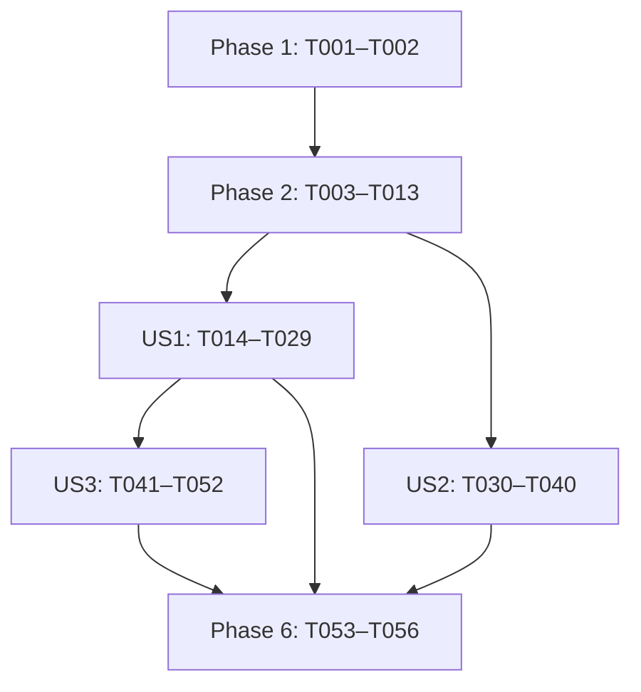

# Tasks: 公共基础与统一意图路由

**Feature**: `002-assistant-foundation` | **Date**: 2026-09-07
**Input**: [spec.md](spec.md)、[plan.md](plan.md)、[research.md](research.md)、[data-model.md](data-model.md)、[quickstart.md](quickstart.md)
**Contracts**: [路由与能力接入](contracts/routing-contract.md)、[会话与SSE](contracts/assistant-api.md)、[用户与设备](contracts/user-device-api.md)、[英文日志](contracts/logging-contract.md)、[prompt资源与绑定](contracts/prompt-contract.md)
**Constitution**: [2.3.0](../../.specify/memory/constitution.md)，包含Entity/DTO、英文日志与AI Service提示词资源规范。
**Workspace**: 实际Git分支为 `master`，Spec Kit活动feature为002；不要求为执行任务切换分支。
**Status**: 已按章程2.3.0与最新Phase 0/1设计同步，复用T001–T056共56项，全部待实施；本次仅更新任务及关联文档，未创建prompt文件、修改业务代码或运行应用/测试。

**Tests**: spec已有Independent Test、Acceptance Scenarios和SC验收要求，章程要求关键逻辑自动化测试；因此保留必要测试任务。优先补充已有测试，避免访问器/注解等实现镜像测试。用户故事内先定义测试预期、确认现状不满足后实施；必要编译桩不能冒充业务实现，最终必须以行为断言通过为证据。

## 格式与执行约定

- 每项包含未完成复选框、连续任务ID、按需的并行/故事标签、描述和文件路径；勾选仅代表该任务的实现和验证已完成。
- 全部路径相对于仓库根目录。新增类/测试/脚本路径是待创建目标；实际调用者/测试引用随迁移同步更新。
- `[P]`只表示在阶段前置条件满足后可与指定同波次任务并行编辑不同文件，不表示可以越过依赖或同时修改共享文件。
- Setup/Foundation/Polish无故事标签，故事阶段严格使用[US1]/[US2]/[US3]；三个故事均为规格原定P1。
- 依赖未单独标注时仍受阶段门禁约束。同一故事的测试定义完成后再实施对应生产路径；共享文件合并、验证记录写入和最终验收串行。

## 复用基线与范围

沿用已有Spring Boot工程、用户/设备/会话表、Mapper、注册登录/管理员功能、SN发现绑定、DTO/SSE和设备客户端；不重新初始化工程或重建公共台账。旧001已完成SN任务是复用证据，不复制为这里的已完成勾选。

本期重写实际Intent Router/AI Config调用链，以四个系统资源和两个用户包装替换固定内联prompt，并补本地装配校验、JSON数据绑定、基础权限、历史/处理隔离、对象归位和英文日志。003知识、004实时查询、001只读诊断/售后、005确定性控制分别交付业务处理器；本期生产缺失处理器返回明确不可用。任何AI输出、旧confirmRepair、会话租约都不构成设备写授权。

**验证环境**：默认verify覆盖单元/契约，带docker标签的IT需`-Pit`；模型协议可用现有WireMock且必须保留被验收的真实AIService，设备路径按quickstart接外部真实deviceSimulator。复用AbstractIntegrationIT时注意它强制mock/开发身份并需模拟器healthz；真实token场景显式使用真实凭据并覆盖开发开关，真实代理测试使用独立模型协议配置。共享Testcontainers集成测试不擅自启用并行执行，故障注入及旧数据迁移测试使用隔离夹具。

## Phase 1: Setup — 复用工程并接入日志依赖

**目标**：在现有基线完成必要依赖与日志配置，不创建第二套工程。

- [X] T001 调整 `pom.xml`：保留 Java21/Boot3.5.3/LangChain4j1.0.1 基线；合并 Lombok 为单一 optional=true 的1.18.36依赖，按日志契约直接声明 spring-boot-starter 并排除 starter-logging、加入 starter-log4j2；按实际传递路径消除 Logback/反向桥接，不新增AI starter。沿用Maven主资源打包，仅在实际配置会过滤或改写prompt字节时修正资源配置，不另加模板引擎或资源插件。

- [X] T002 新增 `src/main/resources/log4j2-spring.xml` 并更新 `src/main/resources/application.yaml`：默认Console、root/项目INFO、英文固定字段及白名单MDC，支持 LOGGING_CONFIG/日志级别/LOGGING_PATTERN_CONSOLE 覆盖；XML读取Boot导出的CONSOLE_LOG_PATTERN，文件输出仅由配置显式启用并附滚动/保留策略，限制SDK/HTTP wire/body原文日志，不能随业务日志级别开启正文输出。（依赖 T001）

**Checkpoint**：日志依赖/配置已具备；应用业务实现和验收不因pom中存在依赖而自动完成。

## Phase 2: Foundational — 共享类型、短事务与日志基础

**前置**：Phase 1完成。本阶段完成前不开始用户故事生产实现。

- [X] T003 [P] 扩展 `src/main/java/com/chh/autosense/exception/ErrorCode.java`、`src/main/java/com/chh/autosense/domain/enums/SessionStatus.java`、`src/main/java/com/chh/autosense/domain/enums/ConclusionType.java` 与 `src/main/java/com/chh/autosense/core/session/statemachine/SessionStateMachine.java`：增加 SESSION_BUSY/AI_SERVICE_UNAVAILABLE/CAPABILITY_NOT_AVAILABLE/REQUEST_TIMEOUT/CONTEXT_EXPIRED、DISPATCHING/FAILED_REQUEST/ERROR，明确公共路由/等待/失败迁移及GUIDED_MANUAL终态；保留历史枚举值。

- [X] T004 [P] 新增 `src/main/java/com/chh/autosense/config/AssistantProperties.java`，调整 `src/main/java/com/chh/autosense/config/LlmProperties.java`、`src/main/java/com/chh/autosense/config/ChatMemoryProperties.java` 和 `src/main/resources/application.yaml`：外部化模型30秒、maxRetries=0、处理120秒、会话租约30秒/续租10秒、上下文1800秒；校验real/mock、real连接/密钥/模型、有限temperature、正时限/相互关系及历史窗口固定20，启动校验不访问远程服务。

- [X] T005 [P] 调整 `src/main/java/com/chh/autosense/domain/entity/User.java`、`src/main/java/com/chh/autosense/domain/entity/Device.java`、`src/main/java/com/chh/autosense/domain/entity/RepairSession.java`、`src/main/java/com/chh/autosense/domain/entity/ProblemReport.java`、`src/main/java/com/chh/autosense/domain/entity/ChatMessage.java`、`src/main/java/com/chh/autosense/domain/entity/RepairActionLog.java`：@Data改@Getter/@Setter并保留public无参构造和全部映射；RepairSession增加可空processingMessageId/processingDeadlineAt，不生成多余equals/hashCode/toString或全参构造。

- [X] T006 新增 `scripts/migration/20260907-assistant-processing.sql` 并同步 `src/main/resources/schema.sql`：仅在repair_session加两列nullable处理字段；保留旧主键/数据，说明前向执行与已应用检查。核对 `src/main/resources/data.sql` 与 `src/main/resources/application.yaml` 的初始化，确保已有库不被schema/seed清空或覆盖，迁移不映射旧DEVICE_ACTION。（依赖 T005、T004）

- [X] T007 [P] 新增 `src/main/java/com/chh/autosense/utils/LogContextUtils.java` 与 `src/main/java/com/chh/autosense/utils/LogSanitizer.java`：复制白名单MDC快照、作用域安装并finally恢复旧值；只允许必要ID/枚举/计数，清理控制字符和长度，异常诊断剔除message/cause/suppressed原文且不把原异常挂回输出。

- [X] T008 新增 `src/main/java/com/chh/autosense/common/RequestLogFilter.java` 并接入 `src/main/java/com/chh/autosense/core/security/SecurityConfig.java`，更新 `src/main/java/com/chh/autosense/common/GlobalExceptionHandler.java`：认证前生成服务端requestId、请求attribute跨dispatch复用、避免重复注册；参数错误WARN只记录字段/规则，未预期异常最终边界一次脱敏ERROR，用户错误体保持兼容。（依赖 T007）

- [X] T009 新增 `src/main/java/com/chh/autosense/core/session/SessionProcessingService.java` 并扩展 `src/main/java/com/chh/autosense/mapper/RepairSessionMapper.java`、`src/main/java/com/chh/autosense/mapper/ProblemReportMapper.java`、`src/main/java/com/chh/autosense/mapper/ChatMessageMapper.java`、`src/main/java/com/chh/autosense/core/session/SessionTransitionLog.java`：以会话行锁短事务提供接纳/正常回调/等待或终态收尾/独立到期结清；验证归属、messageId及数据库截止时间，同事务写消息/状态/追溯并清指针，成功日志在提交后产生；忙请求不保存输入/不改新轮；仅confirmRepair的兼容请求也保存一次确定性USER意向取得messageId，但不是授权。旧回调不写数据，round在同事务确定，模型/设备调用不占事务。（依赖 T003、T006、T007）

- [X] T010 新增 `src/main/java/com/chh/autosense/core/session/memory/ConversationHistoryService.java` 与 `src/main/java/com/chh/autosense/core/session/memory/ConversationHistorySnapshot.java`，扩展 `src/main/java/com/chh/autosense/mapper/ChatMessageMapper.java`：按本人session和当前已保存USER messageId选取之前最近20条USER/ASSISTANT并按id升序；record及集合形成不可变快照，当前文本另传一次，不从旧Redis缓存读模型历史。（依赖 T009）

- [X] T011 新增 `src/main/java/com/chh/autosense/core/session/SessionLeaseService.java`：以autosense:lock:session:{sessionId}执行SET NX+TTL，owner包含当前messageId和随机值，续期/释放原子核对owner；暴露失租约结果并恢复日志MDC，不在日志输出owner。租约失效不授权重放DB截止内请求，时间配置来自AssistantProperties。（依赖 T004、T007）

- [X] T012 新增 `src/test/java/com/chh/autosense/integration/SessionProcessingIT.java` 并复用 `src/test/java/com/chh/autosense/integration/AbstractIntegrationIT.java` 的真实MySQL/Redis：验证两列迁移保留旧记录、六实体映射/主键回填/逻辑删除、短事务并发接纳、正常与已到期条件分开、原子收尾回滚、20条历史边界及owner续租/释放；不实现设备模拟器或执行设备动作。（依赖 T009、T010、T011）

- [X] T013 新增 `src/test/java/com/chh/autosense/support/LogCaptureSupport.java` 和 `src/test/java/com/chh/autosense/unit/LoggingInfrastructureTest.java`：临时Log4j Core appender安装后必须恢复，验证SLF4J实际提供者、Console配置覆盖、白名单MDC安装/恢复、敏感异常链/控制字符清理；不以检查注解或pom文本替代运行绑定断言。（依赖 T008）

**Checkpoint**：共享类型/配置可编译，T012/T013实际验证通过；数据库处理原语、只读历史、owner租约与日志基础可供故事复用。业务路由及账号缺口仍由后续故事接入。

## Phase 3: User Story 1 — 在同一个对话入口使用四类能力（P1，MVP演示范围）

**目标**：真实AIService完成四路分类与安全分发，保留统一入口；不要求四个领域处理器实现。

**Independent Test**：通过已认证公共入口提交四种明确问题、型号/售后、模糊/复合/范围外及模型非法/失败样例；只向目标测试接收器投递一次、身份/轮次准确、无设备写。模糊/复合/缺失接收器零设备读写；实际四代理从六资源加载系统/用户模板并正确绑定JSON资料；本地配置失败零模型请求，字面变量标记不再替换。代理与流式回调由模型协议测试验证。

### 先定义验收测试

- [X] T014 [P] [US1] 新增 `src/test/java/com/chh/autosense/contract/AssistantRoutingContractTest.java`：先定义四类SINGLE、型号知识、售后子模式、普通澄清、复合/条件/多设备写、OUT_OF_SCOPE、未知枚举/矛盾结构及服务故障的分类/错误断言，并验证重复处理器注册启动失败和缺失处理器拒绝；校验候选字段不能产生身份或确认授权；测试分类语义而非提示词全文。

- [X] T015 [P] [US1] 新增 `src/test/java/com/chh/autosense/unit/AiServiceFactoryTest.java`，扩展 `src/test/java/com/chh/autosense/unit/LlmConfigurationTest.java`、`src/test/java/com/chh/autosense/unit/LangChain4jDirectAnswererTest.java`，复用 `src/test/java/com/chh/autosense/support/LogCaptureSupport.java`：WireMock仅模拟模型协议，真实工厂/四代理捕获请求验证六资源生效、JSON数据与角色、三个record解析、配置切换及TokenStream成功/失败/同步完成；按下表覆盖资源/变量/编码失败、零模型请求、字面花括号与脱敏异常。使用隔离测试接口/classloader及内存字节夹具，不以同名测试资源遮盖主资源，不mock掉代理；默认离线测试也覆盖真实工厂，不因应用mock模式跳过。

- [X] T016 [P] [US1] 新增 `src/test/java/com/chh/autosense/support/RecordingCapabilityConfiguration.java` 与 `src/test/java/com/chh/autosense/integration/AssistantRoutingIT.java`：先定义通过实际鉴权、公共入口、编排和SSE进入四个仅src/test注册的接收器的验收；含同会话终态后改问另一能力，每次仅目标接收一次且user/session/message/round与20条历史边界准确，模糊/复合/缺失处理器零设备读写，其余接收器场景零设备写；运行时prompt/数据编码故障明确失败而非歧义或成功，SSE不返回内部prompt及渲染包装。外部夹具操作不计业务调用，真实代理加载证据复用T015。

### Prompt专项验收归属（复用T015，结果由T029记录）

| 验收点 | 必须证明 |
| --- | --- |
| 四代理 / 六资源 | 真实请求的system对应各自资源规则；用户资料由共享conversation-input或diagnosis-input绑定。当前唯一测试标记在text区一次，历史/诊断/伪system指令不进入system；不锁定整篇自然语言提示词作为黄金字符串 |
| 启动预校验 | 缺失/不可读/空白/非法UTF-8/BOM/非UTF-8默认字符集、错误路径/内联value/缺少注解、变量错名/重复/隐式变量/空格写法或@V不匹配均在发布代理前失败，模型请求为零；失败不依赖AiServices.build验证 |
| 参数与编码 | 非null的text JSON字符串、history数组（空→[]）、symptom字符串或JSON字面量null、diagnostics对象（null Map→{}）；嵌套字符串键/值含中文、换行、引号、反斜杠及{{text}}/{{history}}/{{current_date}}，解码值保持原样且不再次替换 |
| 编码边界 | 只对普通JSON数据的字符串键/值转义花括号，结构括号不变；拒绝RawValue/自定义writeRaw等旁路，非法输入失败不回退原文；全局HTTP ObjectMapper与数据库原文不受影响 |
| SDK行为兼容 | 保留record自动输出格式后缀/response format；TokenStream独立验收。运行时资源/渲染/编码失败不转mock、不按模型非法结构澄清，原始异常正文不输出 |
| 日志与历史 | T015用LogCaptureSupport核对装配/同步/流式失败无prompt或数据原文；T016/T042验证内部模板及包装不落SSE/历史，本人输入和合法可见回答照常保存；T044覆盖公共异步日志 |
| 制品检查 | T054在verify后检查Boot JAR六个prompt条目、非空/UTF-8/无BOM及源文件字节一致；与真实代理测试分别提供证据 |

### 实现与整合

- [X] T017 [US1] 新增 `src/main/java/com/chh/autosense/ai/model/RoutingDecision.java`、`src/main/java/com/chh/autosense/ai/model/enums/RoutingOutcome.java`、`src/main/java/com/chh/autosense/ai/model/enums/CapabilityIntent.java`、`src/main/java/com/chh/autosense/ai/model/enums/DiagnosisMode.java` 与 `src/main/java/com/chh/autosense/domain/enums/AssistantCapability.java`：按路由契约定义record/枚举、nullable组合，AI分类和业务能力分离，不增加userId/confirmed/verifiedDeviceId等可信输出字段。（依赖 T014）

- [X] T018 [US1] 将 `src/main/java/com/chh/autosense/core/analysis/ProblemAnalysis.java`、`src/main/java/com/chh/autosense/core/analysis/DiagnosisConclusion.java` 迁至 `src/main/java/com/chh/autosense/ai/model/ProblemAnalysis.java`、`src/main/java/com/chh/autosense/ai/model/DiagnosisConclusion.java` 并更新引用：保留record/字段/语义，编译修正ProblemAnalyzer/DiagnosisReasoner及现有mock适配，领域规则不重写。（依赖 T015）

- [X] T019 [US1] 新增 `src/main/java/com/chh/autosense/core/routing/CapabilityRequest.java`、`src/main/java/com/chh/autosense/core/routing/CapabilityResult.java`、`src/main/java/com/chh/autosense/core/routing/AssistantCapabilityHandler.java`：不可变请求包含服务端AuthUser/session/report/round/message、内容/兼容意向/历史边界/截止及已校验分类；定义异步完成/等待/失败与公共文本sink，状态/持久化归公共入口，控制意向不是授权。（依赖 T017）

- [X] T020 [US1] 新增受Spring管理的 `src/main/java/com/chh/autosense/ai/factory/AiServiceFactory.java` 及 `src/main/resources/prompt/intent-router.txt`、`src/main/resources/prompt/problem-analysis.txt`、`src/main/resources/prompt/diagnosis-reasoner.txt`、`src/main/resources/prompt/direct-answer.txt`、`src/main/resources/prompt/conversation-input.txt`、`src/main/resources/prompt/diagnosis-input.txt`：按prompt契约迁移固定规则与包装，UTF-8无BOM；内嵌四个公开接口，在方法上分别声明@SystemMessage/@UserMessage的fromResource（/prompt/对应文件）及显式@V，创建三个同步record代理与一个TokenStream代理。工厂发布前从实际方法注解以接口Class.getResourceAsStream检查六资源、默认UTF-8字符集、系统零变量、用户精确变量各一次及非null样例渲染；失败安全终止装配、零远程调用、英文日志不含正文或原始cause。不依赖build自动校验，不挂ChatMemory/@MemoryId/tools/toolProvider，不全量扫描BaseTool。（依赖 T017、T018、T015）

- [X] T021 [US1] 重写 `src/main/java/com/chh/autosense/config/LangChain4jConfig.java` 为外部化模型Bean及工厂/适配接线：同步/流式模型采用明确配置与maxRetries、关闭request/response logging、无效mode启动失败；接入T020的资源预校验，real配置失败不转mock。移除四条直接chat/手工JSON解析旁路、旧内联文本块和两个未使用的注解接口；固定系统规则/用户包装不能留在Java常量、注解value或拼接代码中；保留同一工厂及SDK自动结构化输出格式，不新增prompt路径环境变量或远程管理接口。（依赖 T020、T004）

- [X] T022 [US1] 新增纯数据工具 `src/main/java/com/chh/autosense/utils/PromptInputEncoder.java`，调整 `src/main/java/com/chh/autosense/core/routing/IntentClassifier.java`、`src/main/java/com/chh/autosense/core/routing/DirectAnswerer.java`、`src/main/java/com/chh/autosense/core/analysis/ProblemAnalyzer.java`、`src/main/java/com/chh/autosense/core/analysis/DiagnosisReasoner.java` 及 `src/main/java/com/chh/autosense/config/LangChain4jConfig.java` 的适配调用：复用独立Jackson ObjectWriter/CharacterEscapes，只转义普通JSON字符串键/值的花括号为\u007b/\u007d，保留结构并拒绝RawValue/writeRaw等旁路，不改共享HTTP序列化配置或持久原文，编码后直接绑定。四代理共用同轮只读历史；question仅映射text JSON字符串，history空→[]、symptom缺失→JSON字面量null、diagnostics的null Map→{}，所有@V实参非Java null，当前输入只一次。实际调用对应代理，TokenStream通过onPartialResponse/onCompleteResponse/onError/start适配CompletionStage，逐回调安装MDC并记录英文汇总；编码失败不得退回原文拼接。（依赖 T021、T010）

- [X] T023 [US1] 新增 `src/main/java/com/chh/autosense/core/routing/RoutingDecisionValidator.java`：显式校验outcome/intent/diagnosisMode组合并映射业务枚举；模型输出类型/结构/空结果转固定澄清，传输/认证/超时转AI_SERVICE_UNAVAILABLE。与T022适配边界区分运行时prompt读取/渲染和输入编码故障，按技术失败终结并返回统一FAILED_REQUEST/error，不能吞为模型歧义或模拟成功；型号与售后按契约分流，目标线索不查设备/不授权，仅记录英文枚举/原因码。（依赖 T022、T014）

- [X] T024 [US1] 新增 `src/main/java/com/chh/autosense/core/routing/CapabilityDispatcher.java`：按AssistantCapability显式注册，重复注册启动失败，缺失或不可续办返回CAPABILITY_NOT_AVAILABLE；只向匹配处理器传递已验证上下文，记录英文分发结果，不按模型字符串反射、不回退DEVICE_ACTION或旧repair runner。（依赖 T019、T023）

- [X] T025 [US1] 调整 `src/main/java/com/chh/autosense/core/routing/MockIntentClassifier.java`、`src/main/java/com/chh/autosense/core/routing/MockDirectAnswerer.java`、`src/main/java/com/chh/autosense/core/analysis/MockProblemAnalyzer.java`、`src/main/java/com/chh/autosense/core/analysis/MockDiagnosisReasoner.java`：仅在明确mock模式适配新结构与历史输入；四类意图/歧义分开，不将mock模式绑定测试业务处理器，输出保持明确测试用途。（依赖 T022、T024）

- [X] T026 [US1] 重构 `src/main/java/com/chh/autosense/core/session/SessionOrchestrator.java` 的createSession/postMessage/route：接纳一次USER消息、固定历史，完成路由校验和分发；澄清/复合保存等待答复，范围外保存确定性说明，单意图仅交已注册处理器；保留旧领域代码供其他feature复用但断开公共默认设备写/旧confirmRepair直达runner，旧DEVICE_ACTION历史不重解释。（依赖 T025、T009、T010、T016）

- [X] T027 [US1] 在 `src/main/java/com/chh/autosense/core/session/SessionOrchestrator.java` 与 `src/main/java/com/chh/autosense/controller/SessionController.java` 接入完整异步处理生命周期：applicationTaskExecutor提交、AI/处理器回调显式携带MDC；30秒owner租约按10秒续期至持久化结束，固定总截止主动调用到期事务并关流；失租约立即停止后续token和业务结果回调，仅同一消息的到期事务可结清；提交拒绝、重复/晚到回调不改新轮、不虚报成功，HTTP返回emitter不记业务完成。（依赖 T026、T011）

- [X] T028 [US1] 从 `src/main/java/com/chh/autosense/config/LangChain4jConfig.java` 和 `src/main/java/com/chh/autosense/core/session/memory/ChatMemoryFactory.java` 的真实AI装配链退出 `src/main/java/com/chh/autosense/core/session/memory/RedisChatMemoryStore.java` 的自动可写记忆；保留必要历史兼容，不新增平行可写记忆，不把内部分类/分析/提示写入chat_message，旧Redis键仅随TTL失效。（依赖 T027、T022）

- [X] T029 [US1] 执行T014/T015实际代理与路由测试及 `src/test/java/com/chh/autosense/integration/AssistantRoutingIT.java`，在 `specs/002-assistant-foundation/validation.md` 记录命令/模式/报告、四路接收、缺失处理器生产装配、零设备写、最近20条+当前一次及错误闭流证据；补齐六资源实际加载/JSON绑定/角色、字面花括号、配置失败零模型请求与安全日志的结果。只记录资源名、断言结果和脱敏关联，不粘贴prompt/输入正文；修正冲突的既有公共测试，不恢复旧写路径迁就断言。（依赖 T028、T014、T015、T016）

**Checkpoint**：US1可以独立演示分类、澄清、范围说明和能力接收；生产未接入能力仍报告不可用。该演示不是四项领域业务完成，也不替代US2/US3的全部P1验收。

## Phase 4: User Story 2 — 继续使用已有账号与本人设备（P1）

**目标**：沿用账号、管理员和SN绑定行为，修正撤销/归属/并发缺口，保持数据与接口兼容。

**Independent Test**：已有账号注册/登录/me/注销与管理员功能回归，禁用再启用和并发签发不复活旧token；普通用户/越权请求全部拒绝。外部设备按SN绑定、全局唯一、未知型号可绑定且稳定数据保留；错误/冲突零新增、owner原子检查正确，密码不进入响应、日志无凭据，登录token仅按契约返回。

### 先定义验收测试

- [X] T030 [P] [US2] 复用并补充 `src/test/java/com/chh/autosense/contract/UserApiContractTest.java`、`src/test/java/com/chh/autosense/contract/DeviceApiContractTest.java`：锁定注册/登录/me/注销/管理员分页与状态、SN绑定/列表的原URL/状态码/JSON、record校验/null语义；只补缺失断言，覆盖普通用户/他人资源拒绝；密码不出现在响应，token仅按LoginResponse契约返回且不进入日志，不重新创建用户设备测试体系。增加注册密码的ASCII长度、多字节及UTF-8 72/73字节边界测试；72字节且满足其他条件时可注册，73字节返回400/BAD_REQUEST且新增用户为零，错误体与日志不包含密码。

- [X] T031 [P] [US2] 新增 `src/test/java/com/chh/autosense/integration/TokenRevocationIT.java`：真实MySQL/Redis验证token与索引共同有效、统一TTL、孤立token、注销、禁用再启用不复活、并发签发/状态变更、关键Redis失败回滚及启用失败保持禁用；故障注入隔离于其他测试，不用dev token证明真实撤销。

- [X] T032 [P] [US2] 扩展 `src/test/java/com/chh/autosense/integration/DeviceBindingConcurrencyIT.java` 并新增 `src/test/java/com/chh/autosense/integration/DeviceLockIT.java`：真实外部设备服务验证SN全局唯一/未知型号/旧绑定保留，真实Redis验证错误owner续租/释放失败与到期竞争；沿用 `src/test/java/com/chh/autosense/unit/DeviceLockServiceTest.java` 的适用回归，不以Mockito调用次数代替原子性证据。

### 实现与整合

- [X] T033 [US2] 将 `src/main/java/com/chh/autosense/domain/dto/UserView.java`、`src/main/java/com/chh/autosense/domain/dto/AdminUserPageView.java`、`src/main/java/com/chh/autosense/domain/dto/DeviceView.java` 迁至 `src/main/java/com/chh/autosense/domain/vo/UserView.java`、`src/main/java/com/chh/autosense/domain/vo/AdminUserPageView.java`、`src/main/java/com/chh/autosense/domain/vo/DeviceView.java` 并同步生产/测试引用；保持record/工厂/Schema及全部JSON，LoginResponse和请求仍归DTO，不直接暴露User/Device。（依赖 T030）

- [X] T034 [US2] 改进 `src/main/java/com/chh/autosense/service/user/AuthTokenService.java`：签发、验证续期、注销用原子Redis操作同时维护token和usertokens索引，7天滚动TTL一致；缺索引成员直接无效，不补回孤立token；索引撤销失败抛错，残留本体仅尽力清理，失败不恢复旧成员且不记录完整键/凭据。（依赖 T031）

- [X] T035 [US2] 调整 `src/main/java/com/chh/autosense/service/user/UserService.java`、`src/main/java/com/chh/autosense/mapper/UserMapper.java`、`src/main/java/com/chh/autosense/controller/UserController.java`：me经UserService访问Mapper；登录签发/禁用/启用按同用户行串行，查询包含禁用行，锁内复核状态；关键Redis失败传播并回滚数据库，启用先撤销旧索引；保留注册规则/BCrypt/默认普通用户/管理员自身限制并在提交后记录英文结果。在注册流程的BCrypt编码前增加UTF-8字节长度校验，保留现有字符长度、字母/数字及确认密码规则；超限抛BAD_REQUEST，不截断或trim密码，不修改既有哈希及登录验证方式。（依赖 T034、T033）

- [X] T036 [US2] 修正 `src/main/java/com/chh/autosense/core/security/UserTokenResolver.java`、`src/main/java/com/chh/autosense/core/security/BearerTokenAuthFilter.java`、`src/main/java/com/chh/autosense/core/security/SecurityConfig.java` 与 `src/main/java/com/chh/autosense/core/security/DeviceOwnershipChecker.java`：真实token+索引+当前启用账号/角色共同校验，普通用户拒绝管理、管理员仍只访问本人设备会话，Redis不可用拒绝；显式dev模式固定user且生产关闭，认证后补MDC userId、拒绝英文WARN不泄露身份。（依赖 T035）

- [X] T037 [US2] 在 `src/main/java/com/chh/autosense/constant/UserRoleConstants.java` 收敛实际重复的user/admin角色常量并更新 `src/main/java/com/chh/autosense/service/user/UserService.java`、`src/main/java/com/chh/autosense/core/security/UserTokenResolver.java`、`src/main/java/com/chh/autosense/core/security/SecurityConfig.java` 的引用；保留现有角色字符串及权限语义，不添加角色修改或新的权限等级体系。（依赖 T036）

- [X] T038 [US2] 调整 `src/main/java/com/chh/autosense/core/device/DeviceRegistryService.java`、`src/main/java/com/chh/autosense/controller/DeviceController.java`、`src/main/java/com/chh/autosense/core/device/client/DeviceSimulatorClient.java`：复用同一SN发现/绑定及列表逻辑、数据库唯一约束和稳定元数据，失败零新增且错误不泄露归属；保持supported/online投影含义，外部调用记录英文操作/结果/耗时，列表按整体汇总，不打印原始SN/名称/正文或逐项INFO。（依赖 T033、T032）

- [X] T039 [US2] 改进 `src/main/java/com/chh/autosense/core/session/DeviceLockService.java` 并核对 `src/main/java/com/chh/autosense/core/session/DeviceLocator.java`、`src/main/java/com/chh/autosense/core/security/DeviceOwnershipChecker.java`、`src/main/java/com/chh/autosense/core/device/DeviceAdapterRegistry.java` 的共享调用：设备锁沿用10分钟TTL，原子owner校验续租/释放，记录冲突/失效结果；不复制客户端/归属/互斥设施，不把租约当确认或005幂等。（依赖 T032、T036）

- [X] T040 [US2] 运行已有 `src/test/java/com/chh/autosense/unit/UserServiceTest.java`、`src/test/java/com/chh/autosense/unit/UserTokenResolverTest.java`、用户/设备契约及 `src/test/java/com/chh/autosense/integration/UserManagementIT.java`、TokenRevocationIT、DeviceBindingConcurrencyIT、DeviceLockIT；在 `specs/002-assistant-foundation/validation.md` 记录旧数据、撤销/故障回滚、SN唯一性/owner与英文脱敏结果，沿用quickstart的无密码Redis和独立设备前提。（依赖 T037、T038、T039）

**Checkpoint**：US2可通过用户/设备API独立验证，不依赖领域处理器完成；鉴权、token撤销和数据兼容结论必须来自真实相应依赖的验证。

## Phase 5: User Story 3 — 保持会话与公共响应一致（P1）

**前置**：Phase 2及US1完成。US2可独立推进；最终合并验收需其权限修正完成。

**目标**：完整可见历史、跨轮等待/恢复、并发截止与SSE补查一致，英文日志可关联且不泄露内部内容。

**Independent Test**：跨能力/跨轮/多用户以及超过20条历史场景，输入保存一次、完整结果可补查；同会话并发/丢租约/迟到回调/重启超时不污染新轮。等待和终态闭流、断线不回放；状态/日志/持久化事实一致，旧确认不执行设备。

模型配置替换与real失败场景复用US1的T015验收；本故事不重复创建一套AI配置测试。

### 先定义验收测试

- [X] T041 [P] [US3] 扩展 `src/test/java/com/chh/autosense/contract/SessionApiContractTest.java` 与 `src/test/java/com/chh/autosense/unit/SessionStateMachineTest.java`：先定义原五类SSE/HTTP错误体和GET补查兼容、DISPATCHING/FAILED_REQUEST/ERROR增量、等待/终态闭流、GUIDED_MANUAL可新轮及非法迁移；不以mock编排的契约测试代替完整会话行为验收。

- [X] T042 [P] [US3] 新增 `src/test/java/com/chh/autosense/integration/ConversationHistoryIT.java`：实际公共入口测试跨能力/多用户/多轮、20条窗口及当前一次、冷启动/旧Redis缓存、完整人工步骤与售后字段保留后再清投影、旧意图可读及旧确认不能执行；使用含字面模板标记/反斜杠的本人输入验证数据库与GET仍返回原文，内部prompt/渲染包装不进入历史或公开响应。通过仅测试处理器构造结论，不要求交付诊断/控制业务；实际SDK绑定复用T015，不能因原文含同样文本就对历史去重。

- [X] T043 [P] [US3] 新增 `src/test/java/com/chh/autosense/integration/SessionLifecycleIT.java`：定义同会话并发、忙请求不写消息、失租约、迟到回调、固定截止主动收尾、GET/后续POST崩溃恢复、等待续办/取消、断线补查、提交失败和事务回滚；观察真实DB/Redis与SSE，所有恢复零模型重放/设备写，不能只测试内存锁。补充未接纳请求、最终写入回滚及提交结果无法确认的场景：错误流能够关闭，不新增无效用户消息、不修改其他请求、不发送未经确认的成功结论；发送错误通知不改变数据库事实，后续恢复无模型重放或设备写。

- [X] T044 [P] [US3] 新增 `src/test/java/com/chh/autosense/integration/AssistantLoggingIT.java`，复用 `src/test/java/com/chh/autosense/support/LogCaptureSupport.java`：两会话并发/线程复用、同步及异步回调/定时收尾不串MDC；英文关键事件级别正确，prompt正文、渲染资料、凭据测试标记及含敏感message/cause/suppressed的异常不进入最终日志，回滚无成功、单次堆栈、无逐token/列表逐项INFO，降低运行日志后DB追溯仍保存。工厂装配/SDK失败的真实日志断言由T015提供，此处验证公共异步边界；不将合法用户历史的原文保存误判为日志泄露。

### 实现与整合

- [X] T045 [US3] 将 `src/main/java/com/chh/autosense/domain/dto/ChatMessageView.java`、`src/main/java/com/chh/autosense/domain/dto/SessionListItemView.java` 迁至 `src/main/java/com/chh/autosense/domain/vo/ChatMessageView.java`、`src/main/java/com/chh/autosense/domain/vo/SessionListItemView.java` 并更新 `src/main/java/com/chh/autosense/controller/SessionController.java`、`src/main/java/com/chh/autosense/core/session/SessionOrchestrator.java` 和测试引用；保持record及排序/时间/JSON，SessionResponse/ConclusionDto/请求和SseEvent形态不变。（依赖 T041）

- [X] T046 [US3] 调整 `src/main/java/com/chh/autosense/core/session/SessionContext.java` 与 `src/main/java/com/chh/autosense/core/session/SessionContextStore.java`：采用带version/userId/round/messageId/能力的不可变快照，autosense:session:v2:{sessionId}以SET+TTL完整JSON替换，30分钟默认；旧Hash/错版本/归属或轮次不符按上下文失效处理，禁止恢复旧控制授权或保留覆盖前残字段。（依赖 T045）

- [X] T047 [US3] 在 `src/main/java/com/chh/autosense/core/session/SessionOrchestrator.java` 与 `src/main/java/com/chh/autosense/core/session/SessionProcessingService.java` 完成统一可见结果落库：路由/能力结果的完整回答、人工步骤和售后联系方式由公共编排写一次，等待/终态投影与追溯/清指针同事务；失败保存脱敏说明及ERROR投影，不把部分token当完整回答，旧结论完整保存后才清空。（依赖 T046、T042）

- [X] T048 [US3] 调整 `src/main/java/com/chh/autosense/core/session/SessionOrchestrator.java` 的续聊/等待分支并同步 `src/main/java/com/chh/autosense/core/session/statemachine/SessionStateMachine.java`：已结束会话新消息产生新round重新路由，澄清不重复拼当前输入；能力等待先由原处理器判定续办/取消/失效再转新轮，confirmRepair只有可追溯意向、不直达runner，缺失处理器明确失败。（依赖 T047、T041）

- [X] T049 [US3] 在 `src/main/java/com/chh/autosense/core/session/SessionProcessingService.java`、`src/main/java/com/chh/autosense/core/session/SessionOrchestrator.java` 补GET/下一次POST恢复：锁定同一processingMessageId且DB截止已到才结清REQUEST_TIMEOUT，未到期不得因Redis租约缺失重放；旧无安全上下文的活动状态保存中止/失效说明，保留旧ID/意图/历史，任何恢复不覆盖新处理指针或执行设备。（依赖 T048、T043）

- [X] T050 [US3] 调整 `src/main/java/com/chh/autosense/domain/message/SseEventStream.java` 与 `src/main/java/com/chh/autosense/controller/SessionController.java`：替换独立硬编码超时为公共配置协调值，保留五种事件形状与接受前JSON/接受后HTTP200 error语义；awaiting和成功conclusion在持久化提交成功后发送；已接纳业务失败按事务结果发送error。未接纳请求及持久化异常允许按会话契约直接发送脱敏error并关闭流，不伪造已保存状态，不凭闭流清理处理指针或重放执行，连接回调恢复旧MDC，断线不回放/不假成功，连接关闭与业务收尾分离且至多一次。（依赖 T049）

- [X] T051 [US3] 完善 `src/main/java/com/chh/autosense/core/session/SessionTransitionLog.java`、`src/main/java/com/chh/autosense/core/session/SessionOrchestrator.java`、`src/main/java/com/chh/autosense/domain/message/SseEventStream.java` 的英文状态/超时/并发/旧回调事件：记录已验证ID/fromState/toState/result，成功在提交后输出；忙请求不伪装成已有messageId，旧回调用旧快照，最终异常仅一次脱敏堆栈，DB route/state/request追溯不依赖日志级别。（依赖 T050、T044）

- [X] T052 [US3] 执行 `src/test/java/com/chh/autosense/integration/ConversationHistoryIT.java`、`src/test/java/com/chh/autosense/integration/SessionLifecycleIT.java`、`src/test/java/com/chh/autosense/integration/AssistantLoggingIT.java` 及会话/状态机契约回归，在 `specs/002-assistant-foundation/validation.md` 记录跨轮、并发、补查、DTO/历史与日志证据；实际推进完成/等待/失败，不能只验证HTTP外壳或旧001勾选记录。（依赖 T051、T041、T042、T043）

**Checkpoint**：US3完成后，三项公共用户故事均有独立场景；需在最终阶段合并验证公共变更、记录确切结果。

## Phase 6: Polish — 合规审查与交付验证

**前置**：US1、US2、US3均完成；本阶段不实现其他feature的业务能力。

- [X] T053 按 `specs/002-assistant-foundation/plan.md`、`specs/002-assistant-foundation/contracts/routing-contract.md`、`specs/002-assistant-foundation/contracts/logging-contract.md`、`specs/002-assistant-foundation/contracts/prompt-contract.md` 做源码/装配审查并记入 `specs/002-assistant-foundation/validation.md`：四条AI实际调用无旁路，固定规则/包装全部在六资源并由方法级fromResource加载，无内联回退、用户资料进入system或原文编码旁路；业务代码无模型原生HTTP/自动写工具、Controller无Mapper，DTO/VO/枚举/utils归位，record不整体打印。逐项记录15条FR与章程2.3.0证据，保留SDK自动生成格式；未接入领域日志/实体仍归003/004/001/005。

- [X] T054 按 `specs/002-assistant-foundation/quickstart.md` 执行 `mvnw.cmd verify`、runtime/test依赖树、显式IT集合（-Pit配合 `-Dtest=UserManagementIT,DeviceBindingConcurrencyIT,SessionProcessingIT,AssistantRoutingIT,TokenRevocationIT,DeviceLockIT,ConversationHistoryIT,SessionLifecycleIT,AssistantLoggingIT`）及第6节只读JAR脚本，将结果写入 `specs/002-assistant-foundation/validation.md`：核对单一Log4j2提供者/配置、全部公共单元与契约、新基础/路由/令牌/设备锁/历史/会话/日志IT；核对 `target/AutoSense-0.0.1-SNAPSHOT.jar` 中六个BOOT-INF/classes/prompt条目各一次、非空/UTF-8无BOM，分别与 `src/main/resources/prompt/` 六源文件逐字节相同，输出文件名/PASS而非正文。失败按原因修复后重跑受影响检查，不用资源存在替代代理调用测试；不把旧修复全量-Pit纳为002门槛或以默认verify宣称Docker/真实模型已覆盖。（依赖 T053）

- [X] T055 按 `specs/002-assistant-foundation/quickstart.md` 在隔离验证数据上完成注册/登录/绑定/模糊会话/GET历史/注销人工链，并将真实模型无设备副作用小样本的可选执行结果写入 `specs/002-assistant-foundation/validation.md`；不打印秘密，真实模型条件不足记未运行，不能用强制mock的IT声称验证real，不操作业务设备。（依赖 T054）

- [X] T056 回填 `specs/002-assistant-foundation/quickstart.md`、`specs/002-assistant-foundation/plan.md`、`specs/002-assistant-foundation/spec.md`、`specs/002-assistant-foundation/contracts/prompt-contract.md`、`specs/002-assistant-foundation/validation.md` 与 `specs/README.md`：对齐章程2.3.0、实际六资源/注解、已存在测试类与精确命令、资源/绑定/零远程失败/JAR验证证据、实际模式/报告/未运行项和feature状态；只勾选真正完成的 `specs/002-assistant-foundation/tasks.md`，保持其他四个feature范围和旧001完成记录。（依赖 T055）

## Dependencies & Execution Order

1. 默认按T001至T056执行；有并行条件时，仅放开下表列出的波次及无共享写入文件的故事工作。
2. US1和US2在共享基础完成后可以分别推进。US3使用US1的能力契约/公共路由，不能独立重造编排；US2的接口验收不依赖US1领域输出。
3. 同一文件有多项任务时按依赖/编号串行，尤其pom.xml、application.yaml、AiServiceFactory与六prompt资源、PromptInputEncoder、LangChain4jConfig、SessionOrchestrator、SessionController、SecurityConfig及validation.md。
4. 每个故事先写行为断言再实现模型/服务/入口，最后运行对应验收；不能以新增测试文件或旧测试勾选替代执行证据。
5. prompt增量沿T015验收定义→T020资源/工厂→T021配置接线→T022数据编码与适配→T023错误区分→T029实际验证推进；T042/T044接入历史/日志回归，最后T053/T054审查与制品验证。T020的启动样例使用合成非null数据，不依赖尚未实施的T022编码器；按编号串行即可避免循环。
6. 真实模型小样本为独立人工验证，缺少提供商条件时明确记录未运行，不阻断已经满足的离线代理协议验收；不能借此免除默认verify或本期必需IT。

### 可并行波次与每个故事示例

| 前置已完成 | 可并行任务 | 文件边界 |
| --- | --- | --- |
| Phase 1 | T003、T004、T005、T007 | 枚举/状态机、配置、实体、日志utils互不修改同一文件 |
| Phase 2，US1测试定义 | T014、T015、T016 | 路由契约测试、代理/配置/prompt测试、公共入口IT及测试接收器分别独立；T015只读复用T013的LogCaptureSupport |
| Phase 2，US2测试定义 | T030、T031、T032 | 用户设备契约、令牌撤销IT、设备并发/锁IT分别独立 |
| US1完成，US3测试定义 | T041、T042、T043、T044 | 会话外壳/状态机、历史IT、生命周期IT、日志IT分别独立 |

共有14项标记[P]。表中并行针对编辑任务；共享数据库/Redis或进程日志配置的测试执行须隔离或串行，不能从[P]推断测试框架可全量并发。T029/T040/T052向同一validation.md写验证记录，收尾时串行合并。

## Requirements Traceability

| 规格要求 | 主要实现任务 | 关键验证任务 |
| --- | --- | --- |
| FR-001 统一四能力入口 | T017、T023–T027 | T014、T016、T029 |
| FR-002 拆分意图/型号/售后 | T017、T023、T025、T026 | T014、T016 |
| FR-003 本轮/上下文/澄清/失败 | T009、T010、T023、T026–T028、T048 | T014、T042、T043 |
| FR-004 实际AIService重写 | T018、T020–T022 | T015、T029、T053 |
| FR-005 统一外部配置/real失败 | T004、T020–T022、T025 | T015、T029 |
| FR-006 AI候选与设备写隔离 | T019、T020、T023、T024、T026、T048 | T014、T016、T042、T053 |
| FR-007 数据/DTO复用与归位 | T005、T006、T018、T033、T045 | T012、T030、T041、T042 |
| FR-008 用户/管理员及安全存储 | T033–T037 | T030、T031、T040 |
| FR-009 认证/本人范围/撤销 | T009、T034–T037、T039 | T030、T031、T040、T042 |
| FR-010 SN稳定绑定与支持投影 | T033、T038 | T030、T032、T040 |
| FR-011 绑定错误/并发零新增 | T038 | T030、T032、T040 |
| FR-012 长期历史/20条/多轮隔离 | T009–T011、T022、T026–T028、T046–T050 | T012、T015、T042、T043 |
| FR-013 SSE及补查兼容 | T026、T027、T045、T047–T050 | T041、T043、T052 |
| FR-014 追溯及敏感信息 | T007–T009、T022–T024、T027、T035、T036、T038、T047、T051 | T013、T044、T053、T054 |
| FR-015 共享设备基础/互斥 | T038、T039 | T032、T040 |
| 章程：Entity/Lombok/record | T001、T005、T018、T033、T045 | T012、T015、T030、T041 |
| 章程：Log4j2/英文日志/异步关联 | T001、T002、T007、T008、T020、T022、T027、T035、T036、T038、T051 | T013、T015、T044、T053、T054 |
| 章程：资源prompt/方法级fromResource/启动失败/数据绑定 | T020–T023 | T015、T016、T029、T042、T044、T053、T054 |

SC-001由T014/T016验证分类与零写；SC-002由T012/T030/T032/T040/T042验证兼容；SC-003由T013/T030/T031/T044验证拒绝与零泄露；SC-004由T012/T016/T042/T043/T044验证关联与一致性；SC-005由T015/T016/T029/T053验证配置和共享接入。最终证据在T054–T056收敛。

## Implementation Strategy

**MVP演示**：先完成Phase 1、Phase 2与US1，演示统一入口、真实AIService资源加载/JSON绑定/分类/流式适配、澄清/错误和仅测试能力分发；包含本地资源校验失败零模型请求。所有未接入生产能力明确不可用，设备写为零。US1完成后继续推进剩余任务；正式交付002仍要求全部三个P1故事及最终验收。

**增量交付**：US2继续复用账户/设备并补撤销、owner原子性与API兼容；US3在US1链上完成历史、续聊、崩溃恢复、SSE与日志一致性；最终统一验证，不引入003/004/001/005的内部业务。各故事的通过证据独立记录，后续修改共享基础时重跑受影响场景。

**完成统计**：

| 阶段 | 任务范围 | 数量 |
| --- | --- | --- |
| Setup | T001–T002 | 2 |
| Foundational | T003–T013 | 11 |
| US1（P1） | T014–T029 | 16 |
| US2（P1） | T030–T040 | 11 |
| US3（P1） | T041–T052 | 12 |
| Polish | T053–T056 | 4 |
| 合计 | T001–T056 | 56 |

本次复用全部56个任务ID并保持未勾选状态，提示词增量已并入现有实施与验证任务。可选真实模型验证的“未运行”必须保留在交付记录中，不可解释为测试通过；也不把本任务文档生成视为功能已经实施。
