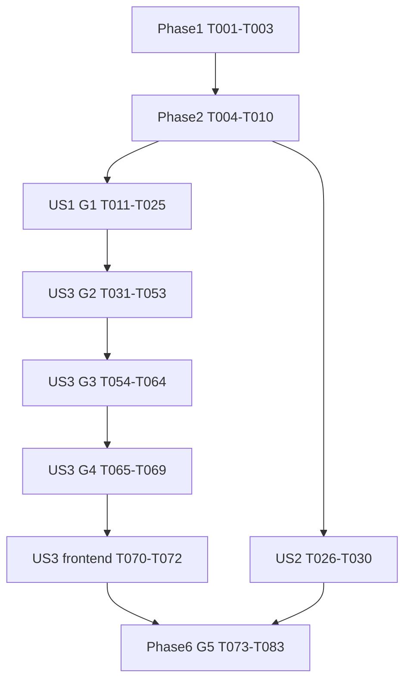

# Tasks: LangGraph4j 多步对话工作流

**Feature**: `002-assistant-foundation` | **Branch**: `dev` | **Date**: 2026-09-15
**Input**: [spec](spec.md)、[plan](plan.md)、[research](research.md)、[data-model](data-model.md)、[quickstart](quickstart.md)
**Contracts**: [graph](contracts/graph-contract.md)、[routing](contracts/routing-contract.md)、[API](contracts/assistant-api.md)、[prompt](contracts/prompt-contract.md)、[logging](contracts/logging-contract.md)、[user/device](contracts/user-device-api.md)
**Constitution**: [v2.3.0](../../.specify/memory/constitution.md)
**Status**: Implementation in progress: T001-T064 complete (72/83). G4 device capabilities are in progress. Previous 59 completed tasks remain archived in history/20260915-before-langgraph-tasks.md.

## 执行、复用与验证约定

- 路径相对于仓库根目录；新增文件为实施目标。同一任务列出的短文件名沿用此前给出的目录。所有任务带连续ID，故事阶段带US标签。
- 三故事均为P1；Phase按故事组织，G1–G5是技术交付门。先测试定义再实现，编译桩不能冒充真实graph、AiServices或MySQL验收。测试依据spec的Independent Test/Acceptance Scenarios/SC及章程关键行为要求。
- `[P]`只允许阶段前置满足后同波次不同文件并行；共享文件、容器IT、全量检查与证据写入串行，详见依赖表。
- 复用用户/设备、DTO、Mapper、专用工厂、Caffeine userId缓存、启动一次共享EmbeddingStore；不恢复统一AiServiceFactory。prompt资源化，英文SLF4J/Log4j2日志保持条件上下文。
- 五类逻辑数据：conversation→repair_session、chat_message→原表、workflow_execution→新表及step/approval/checkpoint内部表、command_execution→新表、audit_event→repair_action_log。扩展三旧表、新增五表，不建平行conversation/audit_event/workflow_event表。
- 本feature负责公共图与现有能力迁接，001/003/004/005负责业务范围；G4不得以stub或旧runner冒充真实能力。未交付能力明确不可用并记录所属feature缺口，缺口未解决不得标G4/完整迁移通过。
- 默认verify与显式-Pit分别记录；模型协议用WireMock+真实代理，MySQL/Redis及deviceSimulator隔离。缺外部前提列未验证，不能静默跳过后勾选。

## Phase 1: Setup — 版本、配置与基线

**目标**：复用已有工程，固定运行约束。

- [X] T001 建立本期验证记录，核对归档的59项完成记录及plan删除矩阵；运行现有默认verify记基线，区分已有与新增失败，不改写旧验证。 文件：`specs/002-assistant-foundation/validation-langgraph.md`。

- [X] T002 仅新增固定langgraph4j-core 1.8.27，保持Java21/Boot3.5.3/LangChain4j1.0.1；编译并核查依赖树，无额外AI集成starter、SDK升级或多SLF4J提供者。 文件：`pom.xml`、`org.bsc.langgraph4j:langgraph4j-core:1.8.27`。

- [X] T003 配置计划8步、planner30秒、知识/诊断60秒、设备10秒、额外重试2次/1000ms、批准TTL300秒、昂贵阈值30秒、活跃区间300秒及图迭代256；real默认，stub显式隔离真实模型/索引/设备。 文件：`src/main/java/com/chh/autosense/config/GraphProperties.java`、`src/main/resources/application.yaml`、`src/main/resources/application-graph-stub.yaml`。

## Phase 2: Foundational — 共用状态及图边界

**目标**：完成各故事共用类型和最小图实验；依赖Phase1。此阶段无应用持久恢复。

- [X] T004 定义九个context及messages十个顶层键；context优先record且可嵌套，防御复制、整体替换、显式清空，禁止Bean/锁/ChatMemory/流对象，PlanContext游标唯一权威。 文件：`src/main/java/com/chh/autosense/graph/state/AssistantState.java`。

- [X] T005 [P] 定义稳定stepId、正式计划、条件/前序引用、步骤结果及状态；涵盖SKIPPED/NOT_EXECUTED/UNKNOWN，AI候选不能成为可信授权。 文件：`src/main/java/com/chh/autosense/graph/state/ExecutionPlan.java`、`src/main/java/com/chh/autosense/domain/enums/WorkflowStatus.java`、`src/main/java/com/chh/autosense/domain/enums/PlanStepType.java`。

- [X] T006 [P] 定义公开OutputContext投影、eventId/sequence/step/status/progress及命令确定性；内部审计与公开事件分开，不暴露state/prompt/凭证。 文件：`src/main/java/com/chh/autosense/domain/message/WorkflowEvent.java`、`src/main/java/com/chh/autosense/domain/vo/WorkflowView.java`。

- [X] T007 定义最小类型化动作及提交边界，区分规划/查询/诊断/控制；依赖注入stub/真实适配，不复用CapabilityDispatcher/text sink或包装SessionOrchestrator。 文件：`src/main/java/com/chh/autosense/graph/node/WorkflowStepActions.java`。

- [X] T008 验证state缺省、局部更新、整体替换、游标镜像及messages按ID限窗；不以访问器或注解存在性代替行为断言。 文件：`src/test/java/com/chh/autosense/graph/StateContractTest.java`。

- [X] T009 建立图运行依赖装配入口，完整MainGraph Bean在T023汇合；MemorySaver仅隔离测试，应用saver于G2接入；内联子图、单次compile、releaseThread(false)，不新增源码根。 文件：`src/main/java/com/chh/autosense/config/GraphConfiguration.java`。

- [X] T010 以最小测试图核对固定core内联子图、SubGraphNode.formatId、stream、updateState返回config的resume语义；共享threadId/state/saver，不依赖尚未实现的完整MainGraph。 文件：`src/test/java/com/chh/autosense/graph/GraphAssemblyTest.java`。

## Phase 3: User Story 1 — 同一入口使用四类能力 (P1 / G1)

**目标**：stub验证四类步骤、多步条件及独立确认。依赖Phase2。
**独立验收**：离线四类问题、查询→条件控制及模糊问题；检查实际graph顺序/中断/跳过/失败停止，外部调用为零。

### 先定义测试

- [X] T011 [P] [US1] 先定义PLAN/CLARIFY/OUT_OF_SCOPE、1..8步、未知类型、重复ID、前向引用/循环、条件深度、缺知识标记及注入授权字段的拒绝/澄清测试。 文件：`src/test/java/com/chh/autosense/graph/PlanValidationTest.java`。

- [X] T012 [P] [US1] 先定义四简单意图、条件true/false、缺引用、连续Query、查询→诊断→控制→独立复检及明确错误/拒绝后剩余未执行测试。 文件：`src/test/java/com/chh/autosense/graph/MainGraphStubTest.java`。

- [X] T013 [P] [US1] 先定义NodeOutput→OutputContext→WorkflowEvent、重复snapshot去重、checkpoint完成才关闭等待流、步骤结果不关流及内部state不泄露测试。 文件：`src/test/java/com/chh/autosense/graph/GraphStreamContractTest.java`。

### 实现与G1验收

- [X] T014 [US1] 定义结构化候选及四类型映射，保留敏感额外字段校验入口；模型不得填写状态、超时、重试或批准。 文件：`src/main/java/com/chh/autosense/ai/model/ExecutionPlanCandidate.java`、`src/main/java/com/chh/autosense/ai/model/enums/PlanOutcome.java`。

- [X] T015 [US1] 实现确定性stub语料、simulated结果、一次超时/明确失败/拒绝/昂贵步骤与稳定operationKey模拟去重；注入只来自fixture/profile，不接受自然语言启用，real缺能力不静默stub。 文件：`src/main/java/com/chh/autosense/graph/node/StubWorkflowActions.java`。

- [X] T016 [US1] 实现候选校验及正式计划hash，CLARIFY等待、OUT_OF_SCOPE正常结束；静态校验不读设备，发布后不增删步骤，未决参数只补运行时绑定。 文件：`src/main/java/com/chh/autosense/graph/node/PlanValidator.java`。

- [X] T017 [US1] 实现确定性路由、白名单比较/AND/OR及前序公开结果引用；false跳过，缺失/类型错失败，清临时上下文，不调用LLM再选路。 文件：`src/main/java/com/chh/autosense/graph/node/PlanRouter.java`。

- [X] T018 [US1] 实现成功/跳过推进、失败整计划停止及确定性汇总，通过T007提交边界输出；失败不标完成，不回滚已发生效果。 文件：`src/main/java/com/chh/autosense/graph/node/CompleteStep.java`、`src/main/java/com/chh/autosense/graph/node/Reject.java`、`src/main/java/com/chh/autosense/graph/node/ResponseAggregator.java`。

- [X] T019 [P] [US1] 构造ResolveTarget→ValidateQuery→PrepareApproval→AwaitApproval→Revalidate→ReadDevice→SaveQueryResult未编译子图；stub亦逐步确认，本地候选解析不外部探测。 文件：`src/main/java/com/chh/autosense/graph/subgraph/QuerySubGraphFactory.java`。

- [X] T020 [P] [US1] 构造PrepareEvidence→RetrieveDiagnosisKnowledge→AnalyzeDiagnosis→SaveDiagnosisResult子图；消费前序证据，不内嵌设备查询/控制/复检。 文件：`src/main/java/com/chh/autosense/graph/subgraph/DiagnosisSubGraphFactory.java`。

- [X] T021 [P] [US1] 构造命令解析/权限风险/独立批准/重查/保存意图/执行/保存结果子图；无隐式读后复检，保留commandId/operationKey，不能绕过确认。 文件：`src/main/java/com/chh/autosense/graph/subgraph/ControlSubGraphFactory.java`。

- [X] T022 [US1] 实现inputRequestId、追问、返回节点及中断；正式计划前可回Planner，发布后仅补runtimeInputs，澄清不是批准/新增目标。 文件：`src/main/java/com/chh/autosense/graph/node/PrepareInput.java`、`src/main/java/com/chh/autosense/graph/node/AwaitInput.java`。

- [X] T023 [US1] 接入stub并汇合规定主图、三子图及失败/澄清边；中断定位内部Await节点，不能对逻辑容器interruptAfter；完成T009的MainGraph Bean装配。 文件：`src/main/java/com/chh/autosense/graph/node/IntentPlanner.java`、`src/main/java/com/chh/autosense/graph/node/KnowledgeConsult.java`、`src/main/java/com/chh/autosense/graph/MainGraphFactory.java`。

- [X] T024 [US1] 实现统一超时分类、有界重试、单步绝对截止/callId成功子结果复用及活跃区间截止；stub证明全部尝试共用预算，明确错误/拒绝不重试，未知写无安全保证即停止。 文件：`src/main/java/com/chh/autosense/graph/node/StepAttemptExecutor.java`。

- [X] T025 [US1] 执行T008/T010–T013实际graph场景及编译检查，记录G1；输出均simulated，MemorySaver通过不代表持久恢复或真实设备安全。 文件：`specs/002-assistant-foundation/validation-langgraph.md`。

**Checkpoint / MVP**：Phase1–3仅为离线图MVP；真实HTTP持久入口在US3的G2，不能提前宣称替换前端对话。

## Phase 4: User Story 2 — 继续使用账号与本人设备 (P1)

**目标**：复用身份、账号与SN绑定，不重建公共功能。依赖Phase2，可与US1不同文件工作并行。
**独立验收**：真实token注册→登录→me→注销、禁用/启用、管理员限制及SN唯一绑定；不依赖真实图能力。

- [X] T026 [P] [US2] 复核并补充真实身份/令牌索引、禁用再启用旧token失效、管理员本人资源限制测试；已覆盖内容复用。 文件：`src/test/java/com/chh/autosense/contract/UserApiContractTest.java`、`src/test/java/com/chh/autosense/integration/TokenRevocationIT.java`。

- [X] T027 [P] [US2] 复核SN全局唯一、未知型号可绑定、失败无新增及online非权威状态测试；管理API不成为LLM绕过查询确认的工具。 文件：`src/test/java/com/chh/autosense/contract/DeviceApiContractTest.java`、`src/test/java/com/chh/autosense/integration/DeviceBindingConcurrencyIT.java`。

- [X] T028 [US2] 核对并仅修复T026暴露的兼容缺口；沿用真实身份服务，Controller不直访mapper，不新建鉴权体系。 文件：`src/main/java/com/chh/autosense/controller/UserController.java`、`src/main/java/com/chh/autosense/service/user/UserService.java`、`src/main/java/com/chh/autosense/core/security/`。

- [X] T029 [US2] 核对并仅修复T027暴露的兼容缺口；保留URL/DTO/错误及稳定数据，图不得调用管理接口绕过确认。 文件：`src/main/java/com/chh/autosense/controller/DeviceController.java`、`src/main/java/com/chh/autosense/service/device/DeviceRegistryService.java`。

- [X] T030 [US2] 运行账号/设备契约及相关IT，记录原有记录仍可用；真实token或模拟器缺失列未验证，不以开发身份替代撤销验收。 文件：`specs/002-assistant-foundation/validation-langgraph.md`。

## Phase 5: User Story 3 — 会话、公共响应及可靠恢复 (P1 / G2–G4)

**目标**：五类数据、HTTP/SSE、确认、幂等、显式恢复、记忆及现有能力迁接。依赖US1；US2切换前通过。
**独立验收**：stub+真实MySQL经HTTP创建/批准/续接，真正重启JVM后本人显式恢复；消息/步骤/命令/审计关联正确。G3真实代理、G4隔离设备分别验证。

### 先定义持久化与恢复测试

- [X] T031 [P] [US3] 先定义旧库升级/新库初始化、三旧表扩展/五新表、旧ID/正文/审计保留及nullable关联/唯一键测试；不建重复workflow_event，不回填可恢复旧命令。 文件：`src/test/java/com/chh/autosense/integration/WorkflowPersistenceMigrationIT.java`。

- [X] T032 [P] [US3] 先定义MySQL saver指定/最新get、历史list、put/release、版本化JSON、缺失/未知版本拒绝及昂贵结果先提交的恢复补齐测试。 文件：`src/test/java/com/chh/autosense/integration/WorkflowCheckpointIT.java`。

- [X] T033 [P] [US3] 先定义逐Query/Control确认、过期/参数变化失效、每次权限重查、重复/并发决定、重试预算不重置及拒绝/明确失败停整计划测试。 文件：`src/test/java/com/chh/autosense/integration/WorkflowApprovalIT.java`。

- [X] T034 [P] [US3] 先定义command唯一身份、写前落库、结果/审计原子提交、事件/消息去重、迟到fence拒绝及UNKNOWN不重发；查询不建命令，审计SUCCESS不等于设备成功。 文件：`src/test/java/com/chh/autosense/integration/CommandExecutionIT.java`、`src/test/java/com/chh/autosense/integration/WorkflowAuditIT.java`。

- [X] T035 [P] [US3] 先定义HTTP契约、本人隔离、真实进程恢复、消息边界、断线补查及旧会话workflow=null；新入口替身不得再依赖旧编排。 文件：`src/test/java/com/chh/autosense/integration/WorkflowRecoveryIT.java`、`src/test/java/com/chh/autosense/contract/WorkflowApiContractTest.java`、`src/test/java/com/chh/autosense/integration/ConversationHistoryIT.java`。

### G2：数据库、事务及恢复

- [X] T036 [US3] 创建前向迁移并同步新库DDL/只读启动schema校验，实现data-model全部字段/索引/长度；旧关联nullable，新事件适用字段必填，不改旧迁移或靠CREATE IF NOT EXISTS升级旧表。 文件：`scripts/migration/20260915-langgraph-workflow.sql`、`src/main/resources/schema.sql`、`src/main/java/com/chh/autosense/config/SessionSchemaValidator.java`。

- [X] T037 [US3] 扩展三旧实体、新建workflow/step/approval/checkpoint/command实体；Getter/Setter与必要构造，保留旧映射及ID，command与audit分开。 文件：`src/main/java/com/chh/autosense/domain/entity/RepairSession.java`、`ChatMessage.java`、`RepairActionLog.java`、`WorkflowExecution.java`、`WorkflowStep.java`、`WorkflowApproval.java`、`WorkflowCheckpoint.java`、`CommandExecution.java`。

- [X] T038 [US3] 实现新实体mapper及旧审计/消息mapper的行锁、version/fence条件更新、幂等键及事件序列查询；MyBatis-Flex参数化访问，无第二套DAO。 文件：`src/main/java/com/chh/autosense/mapper/WorkflowExecutionMapper.java`、`WorkflowStepMapper.java`、`WorkflowApprovalMapper.java`、`WorkflowCheckpointMapper.java`、`CommandExecutionMapper.java`、`RepairActionLogMapper.java`、`ChatMessageMapper.java`。

- [X] T039 [US3] 实现追加审计、稳定event_key、原子sequence及消息output_key去重；params为版本化安全元数据，短result保留、细码写result_code、正文只存chat_message，内部事件不直接发SSE。 文件：`src/main/java/com/chh/autosense/core/session/WorkflowAuditService.java`。

- [X] T040 [US3] 实现接纳/终止/结果短事务：锁会话行保证单活跃计划，关联消息/report/workflow，原子提交步骤/工作流/消息/审计，条件清活动指针；事务不跨网络。 文件：`src/main/java/com/chh/autosense/core/session/WorkflowPersistenceService.java`。

- [X] T041 [US3] 实现每Control步骤一个command/operationKey、批准作用域、PREPARED/IN_FLIGHT/RETRYING/结果状态、attempt/fence及出站claim；意图/审计先提交，结果同步步骤，未知写不按未发送重做，取消不抹效果。 文件：`src/main/java/com/chh/autosense/core/session/CommandExecutionService.java`。

- [X] T042 [US3] 实现认证决定、目标/动作/规范化参数hash、TTL/version与有效批准复用；变更失效、新步骤独立批准，每次请求重查权限，拒绝停整计划并审计。 文件：`src/main/java/com/chh/autosense/core/session/WorkflowApprovalService.java`。

- [X] T043 [US3] 实现BaseCheckpointSaver全部SPI及白名单纯数据序列化；保存nextNode/父ID/graph/schema版本，按fence提交，list最新优先，不在SSE结束时release。 文件：`src/main/java/com/chh/autosense/graph/checkpoint/AssistantStateSerializer.java`、`MyBatisCheckpointSaver.java`、`src/main/java/com/chh/autosense/core/session/WorkflowCheckpointService.java`。

- [X] T044 [US3] 迁移租约并实现MySQL claim/fence与Redis TTL辅助互斥；等待释放资源，重试不延长活跃截止，失租回调不能提交，新执行器不重发未知写。 文件：`src/main/java/com/chh/autosense/core/session/SessionLeaseService.java`、`src/main/java/com/chh/autosense/core/session/WorkflowClaimService.java`。

- [X] T045 [US3] 实现启动只整理WAITING_RESUME、本人显式继续、原threadId/重试预算及成功step/command补齐；缺checkpoint/未知版本失败，终态不复活，批准/GET不代替重启恢复。 文件：`src/main/java/com/chh/autosense/core/session/WorkflowRecoveryService.java`。

- [X] T046 [US3] 提取CRUD/历史并解除旧Accepted依赖；本人过滤、旧状态投影、GET不执行/不调用expire；非终止/UNKNOWN拒绝删除，允许时按依赖处理所有新旧关联表。 文件：`src/main/java/com/chh/autosense/core/session/ConversationQueryService.java`、`AcceptedWorkflow.java`、`src/main/java/com/chh/autosense/core/session/memory/ConversationHistoryService.java`。

- [X] T047 [US3] 接入持久步骤/批准/命令/审计事务，以数据库为尝试权威；复用成功子调用、昂贵阶段及写前/结果后checkpoint；G2允许simulated动作但必须真实持久化。 文件：`src/main/java/com/chh/autosense/graph/node/PersistentWorkflowActions.java`、`src/main/java/com/chh/autosense/graph/node/StepAttemptExecutor.java`。

- [X] T048 [US3] 实现创建/消息/澄清/批准/恢复/取消入口，仅负责认证接纳、claim/预算和graph资源；白名单delta→updateState返回config→resume，等待释放资源，不复制旧路由/能力switch。 文件：`src/main/java/com/chh/autosense/core/session/WorkflowExecutionService.java`。

### G2：API、流及端到端验收

- [X] T049 [US3] 新增批准/恢复/取消DTO及inputRequestId/expectedVersion、可选workflow投影；拒绝上传state/可信授权，保留既有字段和SessionResponse外形。 文件：`src/main/java/com/chh/autosense/domain/dto/WorkflowApprovalRequest.java`、`WorkflowResumeRequest.java`、`WorkflowCancelRequest.java`、`src/main/java/com/chh/autosense/domain/vo/WorkflowView.java`。

- [X] T050 [US3] Controller改用新执行/查询服务，保留会话路径并新增workflow GET/approval/resume/cancel；旧confirmRepair仅映射唯一有效CONTROL批准，不能Query/重启恢复，歧义冲突，不依赖Orchestrator。 文件：`src/main/java/com/chh/autosense/controller/SessionController.java`。

- [X] T051 [US3] 接入graph stream与legacy SSE桥，仅投影OutputContext、按eventId去重，内部审计序列可有间隙；步骤结果不关流，checkpoint中断完成才发送awaiting并关闭。 文件：`src/main/java/com/chh/autosense/graph/WorkflowEventProjector.java`、`src/main/java/com/chh/autosense/controller/SessionController.java`。

- [X] T052 [US3] 接入transport/workflowRequestId、step/attempt的MDC白名单及英文日志；afterCommit才报成功，模型/设备耗时及失败来源可辨，非对话日志无空参数块。 文件：`src/main/java/com/chh/autosense/utils/LogContextUtils.java`、`src/main/resources/log4j2-spring.xml`。

- [X] T053 [US3] 实现进程级验证脚本并执行T031–T035的G2场景；真正重启JVM验证未批准/有效批准/昂贵结果/命令结果已提交恢复，仅本人显式继续执行，旧Redis不作为恢复源。 文件：`scripts/manual-test/langgraph-restart-validation.py`、`specs/002-assistant-foundation/validation-langgraph.md`。

**G2门禁**：数据库批准、命令与重启恢复通过，才接真实能力；MemorySaver不能证明本阶段。

### G3：先定义真实AI、知识与记忆测试

- [X] T054 [P] [US3] 先定义真实AiServices+WireMock多步解析、安全额外字段、模板字符/注入、缺资源/变量不符/模型配置失败和禁止静默mock测试。 文件：`src/test/java/com/chh/autosense/graph/IntentPlannerServiceTest.java`、`src/test/java/com/chh/autosense/unit/AiServiceAssemblyTest.java`。

- [X] T055 [P] [US3] 先定义同用户跨会话隔离、20条历史+当前输入一次、澄清/恢复边界，以及token同步/异步完成、部分输出超时重试/TEXT_RESET、溢出与晚到callback。 文件：`src/test/java/com/chh/autosense/graph/GraphChatMemoryTest.java`、`GraphTokenStreamTest.java`。

- [X] T056 [P] [US3] 迁移旧知识handler有效测试断言至知识业务测试：常识零检索、类型筛选、低分回退、跨型号声明、来源持久化、用户缓存复用，不依赖旧协议。 文件：`src/test/java/com/chh/autosense/unit/KnowledgeCapabilityHandlerTest.java`、`src/test/java/com/chh/autosense/unit/KnowledgeWorkflowServiceTest.java`。

### G3：真实能力接入与验收

- [X] T057 [US3] 创建真实Planner AI Service、专用工厂及资源prompt；复用conversation-input/PromptInputEncoder/AiServiceValidator，方法级fromResource、结构化候选，无设备工具或统一工厂，节点接入。 文件：`src/main/java/com/chh/autosense/ai/IntentPlannerService.java`、`src/main/java/com/chh/autosense/ai/factory/IntentPlannerServiceFactory.java`、`src/main/resources/prompt/intent-planner.txt`。

- [X] T058 [US3] 复用历史建立请求级LangChain4j ChatMemory/messages，按messageId边界限窗；澄清最新输入只一次、恢复不混其他轮次，共享代理不挂可写memory/@MemoryId。 文件：`src/main/java/com/chh/autosense/core/session/memory/GraphChatMemoryAdapter.java`。

- [X] T059 [US3] 认证接纳/取得执行权后直接初始化userId单键代理组合；解除AcceptedConversationInitializer依赖，保留专用工厂、原子发布和过期，不增加会话/设备类型缓存键。 文件：`src/main/java/com/chh/autosense/service/knowledge/UserAiServiceCache.java`、`src/main/java/com/chh/autosense/core/session/WorkflowExecutionService.java`。

- [X] T060 [US3] 从旧handler抽取知识业务并接入KnowledgeConsult；复用共享索引/Advanced RAG/Direct与Enhanced工厂，保留直答/低相关度回退/跨型号说明，提交正文/来源而非text sink。 文件：`src/main/java/com/chh/autosense/service/knowledge/KnowledgeWorkflowService.java`、`src/main/java/com/chh/autosense/graph/node/KnowledgeConsult.java`。

- [X] T061 [US3] 实现容量256队列→嵌入AsyncGenerator→独立OutputContext snapshot→Data.done(finalDelta)；callback不直写SSE，临时token不入audit，失败TEXT_RESET，legacy缓冲至成功，迟到callback不污染新attempt。 文件：`src/main/java/com/chh/autosense/graph/node/AiTokenStreamAdapter.java`。

- [X] T062 [US3] 迁移旧AssistantProperties预算消费者；关闭模型/embedding/device SDK内置重试，由图统一管理，timeout不超剩余截止；embedding启动预算与workflow执行预算分开。 文件：`src/main/java/com/chh/autosense/config/LangChain4jConfig.java`、`KnowledgeEmbeddingConfig.java`、`KnowledgeEmbeddingProperties.java`、`src/main/java/com/chh/autosense/core/device/client/DeviceSimulatorClient.java`、`src/main/java/com/chh/autosense/graph/node/StepAttemptExecutor.java`。

- [X] T063 [US3] 登记planner及所有仍用资源，验证fromResource/UTF-8/变量和安全英文调用日志；保留供应商故障来源，不记完整prompt/消息/原始异常。 文件：`src/main/java/com/chh/autosense/utils/AiServiceValidator.java`、`AiCallLog.java`、`src/test/java/com/chh/autosense/unit/AiCallLogTest.java`。

- [X] T064 [US3] 执行G3真实代理、T054–T056及既有知识/缓存/RAG回归；LLM_MODE=mock仍用相同专用工厂，区分stub流程与mock模型，正文/来源恢复场景通过并记录。 文件：`specs/002-assistant-foundation/validation-langgraph.md`。

### G4：现有领域能力迁接

- [X] T065 [US3] 先定义真实client调用计数：Query确认前零读取、Diagnosis零设备调用、Control无隐式复检；过期权限/批准拒绝、未知写零重发、条件false零命令，复检拒绝保留控制事实。 文件：`src/test/java/com/chh/autosense/graph/DeviceWorkflowSafetyTest.java`。

- [X] T066 [US3] Query子图迁接DeviceLocator/client/adapter及diagnostic_snapshot；本地列表/实时/取证/复检均独立批准，证据含目标/时间，持久结果供后续引用。 文件：`src/main/java/com/chh/autosense/core/device/DeviceQueryService.java`、`src/main/java/com/chh/autosense/graph/subgraph/QuerySubGraphFactory.java`。

- [X] T067 [US3] Diagnosis子图复用规则、DiagnosisReasonerServiceFactory、RAG及售后，消费前序证据，持久诊断/建议/候选；不访问client或调用Control，缺新步骤提示重新规划。 文件：`src/main/java/com/chh/autosense/core/analysis/DiagnosisWorkflowService.java`、`src/main/java/com/chh/autosense/graph/subgraph/DiagnosisSubGraphFactory.java`。

- [X] T068 [US3] Control迁接安全单操作、权限/风险/参数及DeviceLockService；移除runner隐式读取和独立旧日志写入，统一command事务，无远端幂等时UNKNOWN停止，复检另走Query。 文件：`src/main/java/com/chh/autosense/core/repair/RepairExecutor.java`、`src/main/java/com/chh/autosense/graph/subgraph/ControlSubGraphFactory.java`。

- [X] T069 [US3] 将旧修复/人工引导IT改为新独立确认步骤，运行隔离模拟器G4、T065及锁/client回归；无能力路径明确不可用并列所属feature缺口，不以stub代替真实验收。 文件：`src/test/java/com/chh/autosense/integration/AutoRepairFlowIT.java`、`ManualGuideIT.java`、`specs/002-assistant-foundation/validation-langgraph.md`。

### G5前置：前端交互

- [X] T070 [US3] 遵循frontend指南，从新后端OpenAPI再生成客户端及类型，新增workflow查询/批准/恢复/取消DTO，保留其他API，不手写覆盖生成类型。 文件：`frontend/AGENTS.md`、`frontend/src/api/sessionController.ts`、`frontend/src/api/typings.d.ts`。

- [X] T071 [US3] 显示WorkflowEvent步骤/状态/失败、独立Query/Control确认、inputRequestId/version、显式resume/cancel、TEXT_RESET及重复点击保护；兼容legacy避免双文本，断线只GET，simulated/未复检如实展示。 文件：`frontend/src/utils/sse.ts`、`frontend/src/pages/console/ChatPage.vue`。

- [X] T072 [US3] 运行前端type-check/build并手动检查旧会话、多轮、条件、两独立批准、失败停止、刷新、重启继续、重复请求与跨用户拒绝；记录证据，不自动批准。 文件：`specs/002-assistant-foundation/validation-langgraph.md`。

**US3门禁**：G2/G3/G4与前端均有证据；入口切换不能替代Phase6源码删除。

## Phase 6: Polish & Cross-Cutting — G5删除与最终验收

**前置**：三个故事通过；共享职责先迁移再删除，不整包删除core/session。

- [X] T073 在替代职责完整后删除旧Orchestrator/Processing/Transition/Context/Store/RepairRunner/StateMachine源码，迁移全部调用者/Bean/调度；保留新CRUD/事务/租约/数据，无精简壳或旧Redis恢复。 文件：`src/main/java/com/chh/autosense/core/session/SessionOrchestrator.java`、`SessionProcessingService.java`、`SessionTransitionLog.java`、`SessionContext.java`、`SessionContextStore.java`、`RepairExecutionRunner.java`、`statemachine/SessionStateMachine.java`。

- [X] T074 删除旧dispatcher/handler/CapabilityRequest/Result及DirectAnswerer全部回调封装，清text sink装配；保留已抽取知识业务与专用AI工厂。 文件：`src/main/java/com/chh/autosense/core/routing/CapabilityDispatcher.java`、`AssistantCapabilityHandler.java`、`CapabilityRequest.java`、`CapabilityResult.java`、`KnowledgeCapabilityHandler.java`。

- [X] T075 删除旧IntentRouter接口/工厂/候选/prompt及分类器/校验器专属类型；历史展示必要枚举只读保留，不保留可执行旧路由。 文件：`src/main/java/com/chh/autosense/ai/IntentRouterService.java`、`ai/factory/IntentRouterServiceFactory.java`、`ai/model/RoutingDecision.java`、`src/main/resources/prompt/intent-router.txt`、`src/main/java/com/chh/autosense/core/routing/`。

- [X] T076 删除旧initializer/AssistantProperties全部注入及废弃键；确认T059/T062和SSE/租约消费者已迁移，配置无旧链回退开关。 文件：`src/main/java/com/chh/autosense/core/session/AcceptedConversationInitializer.java`、`src/main/java/com/chh/autosense/config/AssistantProperties.java`、`src/main/resources/application.yaml`。

- [X] T077 迁移或移除旧状态机/回调/Processing/Routing测试及记录夹具依赖，保留有效业务断言；补新流程的生命周期/MDC/afterCommit/脱敏回归，不得mock已删除旧链。 文件：`src/test/java/com/chh/autosense/unit/SessionStateMachineTest.java`、`LangChain4jDirectAnswererTest.java`、`src/test/java/com/chh/autosense/integration/SessionProcessingIT.java`、`AssistantRoutingIT.java`、`SessionLifecycleIT.java`、`AssistantLoggingIT.java`、`src/test/java/com/chh/autosense/support/RecordingCapabilityConfiguration.java`、`src/test/java/com/chh/autosense/integration/AssistantLoggingIT.java`、`src/test/java/com/chh/autosense/integration/SessionLifecycleIT.java`。

- [X] T078 核对最终装配：生产禁stub、单一graph引擎、失败无fallback；切换前排空或明确结束无checkpoint旧请求，历史只读兼容，MemorySaver不进应用恢复。 文件：`src/main/java/com/chh/autosense/config/GraphConfiguration.java`、`src/main/resources/application-graph-stub.yaml`。

- [X] T079 同步当前计划/quickstart/规格总览/001与003接入说明及章程过期目录/旧类示例；只落实已授权graph路径及移除，按章程记版本/影响，不扩其他原则，保留旧档案。 文件：`specs/002-assistant-foundation/plan.md`、`quickstart.md`、`specs/README.md`、`.specify/memory/constitution.md`。

- [X] T080 验证装配无旧Bean、全部对话执行走graph且故障无fallback；源码/配置/测试搜索覆盖删除矩阵，新服务无旧route/continueWaiting/回调SSE链，记录结果。 文件：`src/test/java/com/chh/autosense/graph/LegacyOrchestrationRemovalTest.java`、`specs/002-assistant-foundation/validation-langgraph.md`。

- [X] T081 执行完整默认verify并修复迁移失败，核对依赖树及全部实际prompt引用的Boot JAR字节一致；不使用旧固定六资源清单，记录证据。 文件：`pom.xml`、`mvnw.cmd verify`、`specs/002-assistant-foundation/validation-langgraph.md`。

- [X] T082 执行完整verify -Pit、新建/升级库、JVM重启、JAR启动和前端构建验收，含未知写/迟到callback/确认取消竞争/删除/真实设备；外部前提缺失保持未完成并说明。 文件：`specs/002-assistant-foundation/quickstart.md`、`mvnw.cmd verify -Pit`。

- [X] T083 核对全部任务勾选有本期证据，覆盖FR-001–023/SC-001–012，更新spec/plan状态；全部阶段通过且旧源码/Bean/运行引用为零才声明完成。 文件：`specs/002-assistant-foundation/tasks.md`、`validation-langgraph.md`。

## Dependencies & Execution Order

- 无局部说明时按阶段/子阶段顺序执行。T004后T005/T006并行，T007依赖其类型；T009/T010为最小框架装配，不倒依赖T023。
- US1：T011–T013并行定义测试，T014→T015→T016–T018；T019/T020/T021依赖T007/T018后并行，T022后T023汇合，T024统一重试，T025验收。
- US2：T026/T027并行，各自修复T028/T029后T030串行记录；可与US1独立工作，不并发跑共享容器IT。
- US3：T031–T035并行定义；T036→T037→T038依次落schema/实体/mapper。T039–T048按事务/命令/批准/saver/claim/入口顺序，T049–T052串行合入共享Controller，T053是G2门禁。
- G3测试T054–T056并行，生产T057–T063按共享工厂/配置顺序合入，T064验收。G4与前端按序，批准未可靠持久化前不能连接真实设备。
- T073–T078删除须在替代路径/断言迁移后执行，删除同批修复全部编译引用并验证，不能留下可发布的破损构建；T079–T083收尾。

## Parallel Examples

| 故事/波次 | 可并行任务 | 前置及限制 |
| --- | --- | --- |
| US1测试 | T011计划、T012主图、T013流 | Phase2完成，不同测试文件 |
| US1子图 | T019查询、T020诊断、T021控制 | T007/T018契约稳定，T023汇合 |
| US2 | T026账号、T027绑定 | Phase2完成，共享IT运行串行 |
| US3数据测试 | T031升级、T032checkpoint、T033批准、T034命令审计、T035恢复API历史 | US1完成，仅并行编写不同文件 |
| US3真实AI测试 | T054代理、T055memory/token、T056知识 | G2通过；生产工厂/配置随后串行 |

## 需求与契约覆盖

| 要求 | 任务及验收 |
| --- | --- |
| FR-001–006；SC-001/005 | T014–T025、T054/T057、T065–T069：计划/条件/引用/澄清/配置 |
| FR-007–011；SC-002/003 | T026–T030、T042/T048/T050：账号设备及每次请求权限 |
| FR-012–015；SC-004/006 | T035/T039/T046/T049–T064、T070–T072：消息/流/审计/共享能力 |
| FR-016–018；SC-007/008 | T024/T033/T034/T041/T042/T044/T047/T065–T069：批准/重试/幂等/未知结果 |
| FR-019–021；SC-009/010 | T032/T035/T043/T045/T053：checkpoint/停止/昂贵结果/进程恢复 |
| FR-022；SC-011 | T046/T059/T062、T073–T083：职责迁移与删除门禁 |
| FR-023；SC-012 | T031/T034/T036–T041/T053：五类数据/表复用/去重/存量升级 |
| graph/routing | T004–T025、T032–T048、T057/T065–T069 |
| assistant-api/user-device | T006/T013/T026–T035、T046/T048–T051、T070–T072 |
| prompt/logging | T003/T052/T054/T057–T063/T077/T081 |

## Implementation Strategy

1. **骨架MVP**：Phase1–3，T001–T025。验证离线顺序、确认门及输出，不宣称真实控制或跨重启恢复；US2独立回归。
2. **持久HTTP增量**：G2，T031–T053。MySQL/SSE、五类数据及显式恢复验证通过后才接真实能力。
3. **真实能力增量**：G3复用003/专用工厂，G4迁接现有查询/诊断/控制；新业务范围须同步对应feature计划/任务。
4. **最终替换**：前端适配，共享职责迁移后删除旧源码/Bean/配置/测试依赖，完整回归；旧59项记录不转换为新图完成。

**Progress**: 83/83 tasks complete. Evidence: validation-langgraph.md. Application database migration has not been applied.
