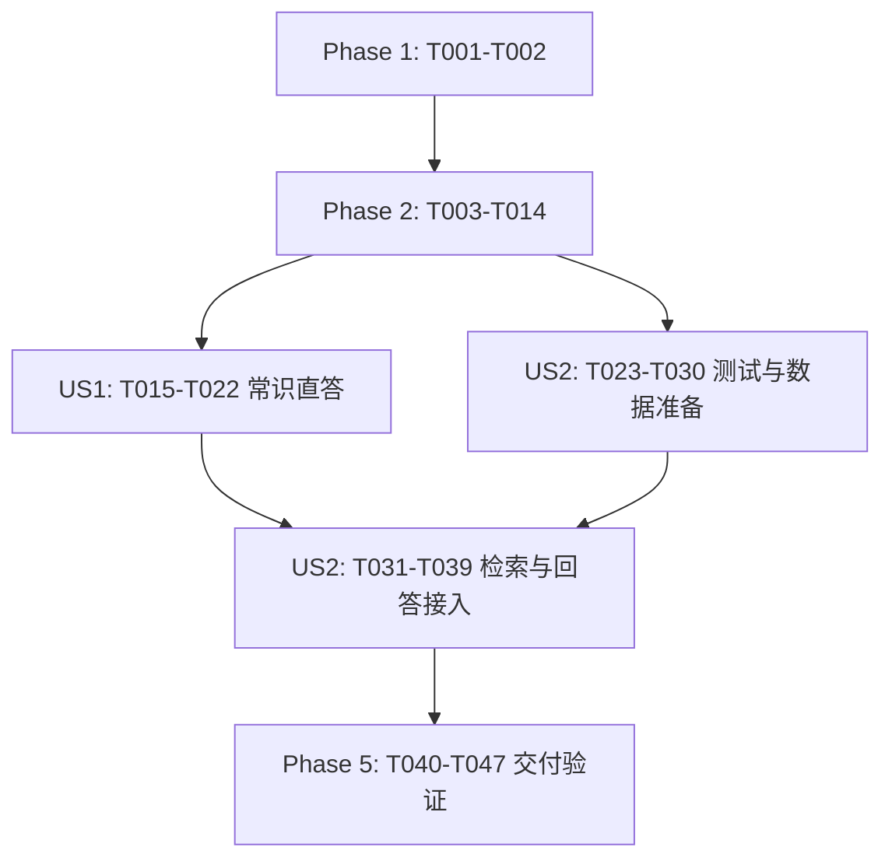

# Tasks: IoT 与设备知识咨询

> **计划同步完成（2026-09-11，最新状态）**：[plan.md](plan.md)、研究、数据模型与契约已落实 FR-003/FR-008：声明依据型号的跨型号回答、公共 AiServiceFactory 创建三代理组合、单个 userId 缓存以及逐请求类型过滤。下面任务仍是旧版，须重新生成并覆盖 SC-008；不再等待计划同步。保留原任务描述/勾选及历史状态供迁移对照，不能直接据旧任务实施。

> **补充失效范围（2026-09-11，FR-003 / FR-008）**：[spec.md](spec.md) 现要求声明依据型号的跨型号回答，以及公共 `aiServiceFactory` 创建、仅以 `userId` 缓存用户服务。旧任务中缺型号即澄清、禁止使用另一型号资料、仅复用原分散工厂及旧缓存结构的描述须依据已同步计划重新生成；既有任务勾选和历史执行记录不作改动。

> **2026-09-11 计划已修订，本任务清单待重新生成。** [plan.md](plan.md) 已改为 ai/rag 中启动一次共享索引、EnhancedAnswerFactory 内嵌 Advanced RAG、逐请求仅设备类型过滤，以及公共工厂创建、单个 userId 缓存用户服务组合。下列旧类路径、外置 augment、复合过滤与“禁止自动 RAG”等描述不再作为实施依据。保留当前勾选状态及历史记录；后续 speckit-tasks 应结合现有代码重新拆分迁移与未完成工作。本次规划不修改任务完成状态，也不以历史 verify 代表当前工作区验证结果。

**Input**: `specs/003-iot-knowledge-assistant/` 下的 [spec.md](spec.md)、[plan.md](plan.md)、[research.md](research.md)、[data-model.md](data-model.md)、[运行契约](contracts/knowledge-runtime.md)、[文档契约](contracts/knowledge-documents.md)及 [quickstart.md](quickstart.md)。

**Prerequisites**: 002 已完成的身份、会话、路由、可见历史、SSE、Guard 和终态持久化；保留现有诊断与设备管理。任务只列本 feature 的新增/接入/必要回归，不重新实现已完成能力。

**Tests**: spec 的 Independent Test、FR-005 和 SC-001～007 明确要求分支、相关度、隔离及启动失败验收；章程另要求关键逻辑与实际 AI 资源加载测试，因此包含对应自动化任务。先编写相应失败场景，再完成实现并通过测试；不得以空断言、禁用测试或只检查注解替代行为验证。

**Organization**: 两个故事均为 P1。公共启动完整建库是 FR-013 的全局前置条件，故放 Foundational；US1 交付常识直答，US2 交付范围解析、检索回答和回退。任务初始全部未完成，不把现有工厂、资料或设计文档误标为新功能已经交付。

**Execution status (2026-09-10)**: 按用户范围完成 Phase 1 / Phase 2（T001–T014）；完整 verify 通过 156 项测试。T015–T047 尚未实施。详见 [validation.md](validation.md)。

## Format: `[ID] [P?] [Story] Description`

- 所有路径相对仓库根目录；新增 Java 根包为 `com.chh.autosense`。
- `[P]` 仅标同一阶段、前置条件完成后可在不同文件中并行的任务，不代表可以跳过阶段依赖。具体并行组见文末。
- 用户故事任务使用 `[US1]`/`[US2]`；Setup、Foundational、Polish 不加故事标签。
- 新增不可变对象用 Java 21 record；AI 输出 enum 放 `ai/model/enums/`，业务 enum 放 `domain/enums/`；构造器注入，通用工具目录为 `utils/`。
- 真实模型调用必须经 LangChain4j；固定系统/用户模板使用 `/prompt/` 资源。Caffeine 的有限章程偏离沿用 plan，只缓存无状态代理；Redis 身份、上下文与租约保持原职责。

## Phase 1: Setup — 复用既有工程

**Purpose**: 准备唯一新增依赖与可复用验收夹具，无新工程、公开 API 或数据库表。

- [X] T001 在 `pom.xml` 添加由 Spring Boot 3.5.3 管理版本的 `com.github.ben-manes.caffeine:caffeine`；保持 Java 21、LangChain4j 1.0.1 和现有 Log4j 2 依赖，复用 langchain4j-open-ai，不引入 easy-rag、外部向量库或数据库迁移。
- [ ] T002 [P] 在 `src/test/java/com/chh/autosense/support/KnowledgeFixtures.java` 和 `src/test/java/com/chh/autosense/support/DeterministicEmbeddingModel.java` 建立可计数的确定性向量/来源夹具，覆盖 light/空调、不同品牌型号、GENERAL/TROUBLESHOOTING、无候选、边界得分、冲突与损坏资源；复用现有 WireMock/集成支持，不调用真实模型或设备、不改生产知识正文。

**Checkpoint**: 依赖与夹具可用于后续单元/契约测试；本阶段不改变知识路由行为。

## Phase 2: Foundational — 所有知识对话的前置条件

**Purpose**: 外部化配置、完整启动索引、服务缓存与接纳后初始化。FR-013 要求建库成功后才能接收业务，不能为了先演示 US1 绕过此阶段。

### 基础行为测试

- [ ] T003 [P] 在 `src/test/java/com/chh/autosense/unit/KnowledgeConfigurationTest.java` 编写配置/装配失败测试：真实 embedding 配置缺失、未知 provider/store、real 搭配 mock、非法 TTL/容量/分段/门槛/批量、别名歧义及三次聊天加 embedding 和 5 秒余量超出公共预算；验证独立模型配置与关闭正文日志。
- [ ] T004 [P] 在 `src/test/java/com/chh/autosense/unit/KnowledgeIndexInitializationTest.java` 编写加载测试：元数据/分段继承、两文件配对、重启来源稳定、零 RepairKnowledgeMapper 读取，以及缺失/重复/坏 UTF-8/BOM/空白/解析/超限/向量数量或维度/写入/启动超时全部失败且不发布部分索引。
- [ ] T005 [P] 在 `src/test/java/com/chh/autosense/unit/UserAiServiceCacheTest.java` 编写同用户并发原子创建、不同用户隔离、30 分钟访问过期、容量驱逐、失败不缓存半成品、在途引用不失效和构建零模型请求测试；使用可控 Caffeine Ticker，避免实际等待 TTL。

### 基础实现

- [ ] T006 在 `src/main/java/com/chh/autosense/config/KnowledgeProperties.java`、`src/main/java/com/chh/autosense/config/KnowledgeEmbeddingProperties.java` 和 `src/main/resources/application.yaml` 实现 `autosense.knowledge` 属性绑定与校验，落实文档契约全部默认值及 KNOWLEDGE_EMBEDDING_* 环境映射，独立于旧 autosense.rag；校验最坏串行调用预算严格小于既有处理截止，不输出凭据/配置原文。
- [ ] T007 在 `src/main/java/com/chh/autosense/config/KnowledgeEmbeddingConfig.java` 和 `src/main/java/com/chh/autosense/service/knowledge/MockKnowledgeEmbeddingModel.java` 装配共享 EmbeddingModel：real 使用已配置 OpenAiEmbeddingModel（可选 dimensions、10 秒、0 重试、批量 32），显式 mock 使用确定性本地实现；入库/查询共用模型并验证向量数量、维度、有限值，无故障自动降级。
- [ ] T008 在 `src/main/java/com/chh/autosense/service/knowledge/KnowledgeDocumentLoader.java` 实现 Spring classpath 资源枚举、严格路径/两文件配对/UTF-8/字节上限校验，薄 DocumentSource 适配输入流并逐文件调用 LangChain4j DocumentLoader/TextDocumentParser；从目录文件名生成全部来源/类型/型号/分类/hash 元数据，复用 `src/main/resources/document/light/MI-MJDPL01YL/general.md` 和 `src/main/resources/document/light/MI-MJDPL01YL/troubleshot.md`，不使用 getFile 或会跳过错误的批量加载器。
- [ ] T009 在 `src/main/java/com/chh/autosense/service/knowledge/KnowledgeDocumentSplitter.java` 用 LangChain4j recursive splitter 按 1000/150 字符分段，继承文档 metadata 和 index、生成稳定 segmentId、校验总段数不超 10000；不执行 Markdown 内代码/链接，不把字符数当 token 数。
- [ ] T010 在 `src/main/java/com/chh/autosense/service/knowledge/KnowledgeIndexInitializer.java`、`src/main/java/com/chh/autosense/service/knowledge/KnowledgeIndexSnapshot.java` 和 `src/main/java/com/chh/autosense/config/KnowledgeConfig.java` 实现同步完整启动导入：EmbeddingStoreIngestor 写入未发布 InMemoryEmbeddingStore，成功后发布标准 EmbeddingStore<TextSegment>、来源集合与模型/schema/分段指纹快照；任何失败或 300 秒预算耗尽中止启动且迟到结果不能发布，不允许业务可用窗口、空/部分索引或维修知识表兜底。
- [ ] T011 在 `src/main/java/com/chh/autosense/ai/factory/DirectAnswerServiceFactory.java` 和 `src/main/java/com/chh/autosense/ai/factory/ProblemAnalysisServiceFactory.java` 将本次触及的依赖改为构造器注入，保留现有方法与实际资源校验，保证每次工厂创建无状态代理且零模型请求；不配置 ChatMemory、tools 或自动 RAG，不改变原诊断调用契约。
- [ ] T012 在 `src/main/java/com/chh/autosense/service/knowledge/UserAiServices.java`、`src/main/java/com/chh/autosense/service/knowledge/UserAiServiceCache.java` 和 `src/main/java/com/chh/autosense/ai/factory/MockKnowledgeAiServicesFactory.java` 实现缓存完整服务对：认证 userId 为键、cache.get 原子调用对应工厂、默认 1000/30m；显式 mock 工厂提供同接口本地服务桩。驱逐不关闭共享客户端，缓存不保存历史/证据/TokenStream/回调/身份结论，创建失败可重试。
- [ ] T013 在 `src/main/java/com/chh/autosense/core/session/AcceptedConversationInitializer.java`、`src/main/java/com/chh/autosense/service/knowledge/KnowledgeConversationInitializer.java` 和 `src/main/java/com/chh/autosense/core/session/SessionOrchestrator.java` 接入可选初始化协作者：成功接纳并建立 Guard 后、路由/等待续走前获取当前用户服务对，首个非知识对话也初始化；无003装配时无操作，失败走既有收尾且清除处理指针，不在数据库事务内调用模型。
- [ ] T014 在 `src/test/java/com/chh/autosense/contract/KnowledgeAdmissionContractTest.java` 验证 T013 的接纳边界：首次非知识请求也创建、同用户后续复用，登录/GET/未授权/SESSION_BUSY 不创建，注销/禁用或跨用户访问不能因缓存命中绕过认证，初始化异常正确结清；执行 T003～T005 并修复基础装配回归。

**Checkpoint**: 完整索引、配置和缓存均就绪；基础测试通过。仅 memory 为已支持 store，明确拒绝 external 配置；任何后续故事不得绕过启动失败规则。

## Phase 3: User Story 1 — 咨询 IoT 与设备常识 (Priority: P1) — MVP

**Goal**: 未绑定设备的已登录用户获得常识解释与本人会话追问，使用缓存 DirectAnswerService，无知识检索或设备调用。

**Independent Test**: “色温和亮度有什么区别？”及同会话追问：requiresKnowledgeBase=false、范围分析/query embedding/search/设备调用均为零，SSE 与持久化回答一致；其他用户或会话历史不混入。

### Tests for User Story 1

- [ ] T015 [P] [US1] 在 `src/test/java/com/chh/autosense/contract/KnowledgeCommonSenseContractTest.java` 编写未绑定用户常识/追问、零范围分析/检索/设备调用与五类 SSE 兼容测试；加入实际状态/诊断/控制输入继续公共分流及注入文本不能触发设备操作的回归。
- [ ] T016 [P] [US1] 在 `src/test/java/com/chh/autosense/unit/KnowledgeDirectAnswerServiceTest.java` 通过真实 AI Service + WireMock 验证资源加载、history/text/context 各一次、20 条历史投影、本轮不重复、花括号/Unicode 数据不会二次插值，缺失/空/BOM 资源失败；同代理并发回答的消息和 token 独立。

### Implementation for User Story 1

- [ ] T017 [US1] 在 `src/main/java/com/chh/autosense/domain/dto/KnowledgeDirectAnswerContext.java` 和 `src/main/java/com/chh/autosense/domain/enums/KnowledgeDirectAnswerReason.java` 定义不可变直答上下文与 COMMON_SENSE/TYPE_UNKNOWN/NO_MATCH/LOW_RELEVANCE 原因，不携带认证、设备或模型内部对象，供常识和后续回退复用。
- [ ] T018 [US1] 在 `src/main/java/com/chh/autosense/ai/DirectAnswerService.java` 新增 answerKnowledge(history,text,answerContext):TokenStream，保留 answer；在 `src/main/resources/prompt/knowledge-direct-answer.txt` 和 `src/main/resources/prompt/knowledge-direct-input.txt` 定义资源系统规则/用户模板，用 SystemMessage/UserMessage fromResource 与显式 @V 绑定，约束不编造型号参数/来源、不执行设备操作，由原工厂验证全部方法。
- [ ] T019 [US1] 在 `src/main/java/com/chh/autosense/utils/PromptInputEncoder.java` 增加 KnowledgeDirectAnswerContext 的受控 JSON 编码，复用隔离 ObjectWriter、大括号转义和既有历史编码；不改变全局 Jackson、不把运行时文本提升为系统规则。
- [ ] T020 [US1] 在 `src/main/java/com/chh/autosense/core/routing/DirectAnswerer.java`、`src/main/java/com/chh/autosense/core/routing/LangChain4jDirectAnswerer.java`、`src/main/java/com/chh/autosense/core/routing/MockDirectAnswerer.java` 及 `src/main/java/com/chh/autosense/ai/factory/MockKnowledgeAiServicesFactory.java` 接入服务端 AuthUser/直答上下文和缓存代理，同步更新 `src/test/java/com/chh/autosense/unit/LangChain4jDirectAnswererTest.java`；保留 TokenStream、AiCallLog 和异步 MDC 边界，为非 COMMON_SENSE 原因拼接准确缺口说明且不伪称检索过。
- [ ] T021 [US1] 在 `src/main/java/com/chh/autosense/core/routing/KnowledgeCapabilityHandler.java` 注册 KNOWLEDGE 并处理 requiresKnowledgeBase=false，调用缓存直答适配器后返回既有 CapabilityResult；使用公共 visibleText/Guard/finish，无独立控制器、设备依赖或新 SSE 事件。US2 接入前 true 分支明确能力未完成，不偷用无条件直答替代检索。
- [ ] T022 [US1] 在 `src/test/java/com/chh/autosense/integration/KnowledgeCommonSenseIT.java` 复用现有数据库/会话测试支持验证未绑定用户、追问、跨用户拒绝及 SSE 聚合文本/ConclusionDto.summary/GET/历史一致，内部上下文不作为 USER 消息；通过 T015/T016 与原直答回归。

**Checkpoint**: US1 可独立演示常识咨询，必须已有完整启动索引。US2 true 分支未交付前，不宣称全部知识咨询可用，也不能用直接回答降级掩盖未实现检索。

## Phase 4: User Story 2 — 获得有依据的型号与使用说明 (Priority: P1)

**Goal**: 非常识问题按类型和适用范围检索，达标资料由缓存 ProblemAnalysisService 回答；类型未知、无资料或低相关按约定直接回答，缺必要信息澄清，故障和冲突明确区分。

**Independent Test**: 固定模型/资料夹具覆盖匹配、跨类型/型号、已知但未收录类型、未知类型、缺型号/版本/环境、空/低分/门槛等值、冲突、技术故障；核对服务选择、实际检索次数、来源白名单和零设备操作，不以模型表面回答代替调用计数。

### Tests for User Story 2

- [ ] T023 [P] [US2] 在 `src/test/java/com/chh/autosense/unit/KnowledgeQueryServiceTest.java` 编写目录/配置类型别名解析、未知型号严格约束、已知未收录类型仍检索、TYPE_UNKNOWN 优先直答、缺品牌/型号/版本/环境澄清、非法分析输出失败及不读取用户设备的测试。
- [ ] T024 [P] [US2] 在 `src/test/java/com/chh/autosense/unit/KnowledgeRetrievalTest.java` 验证真实 ContentRetriever + 请求私有 QueryRouter/Augmentor：search 前类型/品牌/型号/分类 filter、一次 query embedding/search、0.75 等值通过、空与低分区分、回放不重检索、非法得分/metadata/维度或检索故障不变成空结果、并发请求不串范围。
- [ ] T025 [P] [US2] 在 `src/test/java/com/chh/autosense/unit/KnowledgeProblemAnalysisServiceTest.java` 使用真实代理 + WireMock 验证新增知识解析/结构化回答资源、catalog/evidence 安全编码、原 analyze 兼容、冲突及引用缺失/越界/伪造链接在输出前被拒绝，保留至少一份同源冲突段落和跨来源冲突夹具。
- [ ] T026 [P] [US2] 在 `src/test/java/com/chh/autosense/contract/KnowledgeAnswerContractTest.java` 编写运行契约分支矩阵，断言 direct/problem-analysis 服务选择、检索次数、准确回退文案、CLARIFYING 后重新路由、低分资料不进 evidence、异常错误码与公共收尾、prompt 注入零工具调用。
- [ ] T027 [P] [US2] 在 `src/test/java/com/chh/autosense/integration/KnowledgeSourcesIT.java` 编写完整检索回答来源持久化验收：sourceId/hash 与问题/轮次关联，token/summary/GET/历史一致，内部资料不污染可见历史，保存失败不得发送成功 conclusion，资料冲突给出可追溯说明。

### Implementation for User Story 2

- [ ] T028 [US2] 在 `src/main/java/com/chh/autosense/ai/model/KnowledgeQueryAnalysis.java`、`src/main/java/com/chh/autosense/ai/model/KnowledgeAnswer.java` 及 `src/main/java/com/chh/autosense/ai/model/enums/KnowledgeAnswerStatus.java`、`src/main/java/com/chh/autosense/ai/model/enums/KnowledgeInformationKind.java`、`src/main/java/com/chh/autosense/ai/model/enums/KnowledgeMissingInformation.java` 定义 AI 输出 record/enum，落实 data-model 的空值、集合、ANSWERED/CONFLICT、必要信息及查询文本规则；保留原 ProblemAnalysis。
- [ ] T029 [US2] 在 `src/main/java/com/chh/autosense/domain/dto/KnowledgeQuery.java`、`src/main/java/com/chh/autosense/domain/dto/KnowledgeEvidence.java`、`src/main/java/com/chh/autosense/domain/dto/KnowledgeRetrievalResult.java` 及 `src/main/java/com/chh/autosense/domain/enums/KnowledgeKind.java`、`src/main/java/com/chh/autosense/domain/enums/RetrievalOutcome.java` 定义校验后的查询/只读证据/计数结果，保留版本环境条件和来源/hash/score，区分 SUFFICIENT/NO_MATCH/LOW_RELEVANCE，不把技术异常编码成资料不足。
- [ ] T030 [US2] 在 `src/main/java/com/chh/autosense/service/knowledge/KnowledgeCatalog.java` 合并启动来源快照与配置类型/品牌/型号别名，生成安全名称 catalog；包含明确配置但暂无资料的类型，不依赖设备列表或诊断白名单，不模糊替换未知型号，识别歧义与不合法别名。
- [ ] T031 [US2] 在 `src/main/java/com/chh/autosense/ai/ProblemAnalysisService.java` 增加 analyzeKnowledge(history,text,catalog) 与同步 answerKnowledge(history,text,evidence)，保留 analyze；创建 `src/main/resources/prompt/knowledge-query-analysis.txt`、`src/main/resources/prompt/knowledge-query-input.txt`、`src/main/resources/prompt/knowledge-answer.txt`、`src/main/resources/prompt/knowledge-answer-input.txt`，明确类型未知优先、适用范围、缺口/冲突、来源 ID 和不可信资料规则；通过 `src/main/java/com/chh/autosense/ai/factory/ProblemAnalysisServiceFactory.java` 校验全部资源，同步更新 `src/main/java/com/chh/autosense/ai/factory/MockKnowledgeAiServicesFactory.java` 的新增方法本地桩。
- [ ] T032 [US2] 在 `src/main/java/com/chh/autosense/utils/PromptInputEncoder.java` 扩充 catalog、已校验适用条件和 evidence 的白名单 DTO 编码，保持 @V 恰好一次与大括号转义；不传候选低分资料、凭据、内部实体或重复当前问题，补充 `src/test/java/com/chh/autosense/unit/KnowledgeProblemAnalysisServiceTest.java` 的真实消息编码断言。
- [ ] T033 [US2] 在 `src/main/java/com/chh/autosense/service/knowledge/KnowledgeQueryService.java` 调用当前用户缓存的 ProblemAnalysisService.analyzeKnowledge 并校验输出，用 catalog 标准化范围；TYPE_UNKNOWN 返回直答决策，必要信息缺失返回澄清，否则生成 KnowledgeQuery；不猜测用户设备、不把明确但未收录类型误判为类型未知，保留版本/环境用于回答适用性检查。
- [ ] T034 [US2] 在 `src/main/java/com/chh/autosense/service/knowledge/KnowledgeQueryRouter.java` 实现请求私有 QueryRouter：route 内只调用一次绑定范围的 ContentRetriever，校验 score/metadata 后按 >= 门槛筛选并稳定排序，充分时返回只回放不可变结果的 Retriever，空/低分返回空集合并记录本次原因；错误向上传播，无 ThreadLocal 或共享可变过滤器。
- [ ] T035 [US2] 在 `src/main/java/com/chh/autosense/service/knowledge/KnowledgeAugmentorFactory.java` 以标准 EmbeddingStore/EmbeddingModel 创建范围过滤的 EmbeddingStoreContentRetriever（topK、技术 minScore=0.0），向 DefaultRetrievalAugmentor 注入 T034 Router、默认单 Query transformer 和 identity ContentInjector；不使用 1.0.1 不存在的 invocationParameters，不给缓存 AI Service 安装自动 RAG。
- [ ] T036 [US2] 在 `src/main/java/com/chh/autosense/service/knowledge/KnowledgeRetrievalService.java` 显式执行一次 augment 并读取 contents 与 Router 决策，封装达标 evidence/计数和来源关联；检查索引模型指纹/维度兼容，不依赖 InMemory 私有 API、不放宽类型或在故障后重试第二次检索。
- [ ] T037 [US2] 在 `src/main/java/com/chh/autosense/service/knowledge/KnowledgeSourceValidator.java` 校验 KnowledgeAnswer 状态、正文、来源非空子集与冲突来源规则，拒绝伪造引用/来源链接；使用 catalog 中的安全 sourceName/sourceId/documentHash 生成来源尾注并处理 Markdown/控制字符，不把随机 embedding ID 当稳定来源。
- [ ] T038 [US2] 在 `src/main/java/com/chh/autosense/service/knowledge/KnowledgeAnswerService.java` 用当前用户缓存的 ProblemAnalysisService.answerKnowledge 同步生成答案，先执行 T037 校验再输出可见文本/尾注，明确冲突与资料缺口；使用 AiCallLog 记录阶段/耗时/安全失败，不打印 evidence、提示词或模型正文，不把同步结果宣称为原生 token 流。
- [ ] T039 [US2] 在 `src/main/java/com/chh/autosense/core/routing/KnowledgeCapabilityHandler.java` 接通 true 分支的解析→澄清/直接回退/检索→有依据回答，保证 common-sense/type-unknown 零检索、NO_MATCH/LOW_RELEVANCE 调用 DirectAnswerService、技术错误按既有错误码失败；通过 `src/main/java/com/chh/autosense/core/session/SessionProcessingService.java` 既有 finish 保存完整答案/尾注/summary 和审计，只有确有必要才修改持久化逻辑，保持等待续走 REROUTE 语义与公共 SSE 外形。

**Checkpoint**: US1 与 US2 的分支和来源验收均可独立运行；无索引加载/检索假成功，无其他类型/型号或低分资料误引用。进入跨故事检查前运行 T023～T027 并修复本故事回归。

## Phase 5: Polish — 跨故事可靠性与交付验证

**Purpose**: 完成共同截止、并发、日志、打包资源和文档验收；不扩展到外部数据库实现或重写其他 feature。

- [ ] T040 在 `src/main/java/com/chh/autosense/service/knowledge/KnowledgeQueryService.java`、`src/main/java/com/chh/autosense/service/knowledge/KnowledgeRetrievalService.java`、`src/main/java/com/chh/autosense/service/knowledge/KnowledgeAnswerService.java`、`src/main/java/com/chh/autosense/core/routing/KnowledgeCapabilityHandler.java` 和 `src/main/java/com/chh/autosense/core/session/SessionOrchestrator.java` 贯通原始 deadline/Guard：每步开始前检查剩余预算，重试纳入预算，超时后不启动下一调用、不接受迟到 token/成功回调，外部调用不跨数据库事务；正确映射 AI_SERVICE_UNAVAILABLE/REQUEST_TIMEOUT/INTERNAL_ERROR 与英文原因标签。
- [ ] T041 [P] 在 `src/test/java/com/chh/autosense/integration/KnowledgeConcurrencyIT.java` 验证同用户两会话并发复用代理时历史/evidence/token/回调/MDC 隔离，跨用户拒绝、缓存驱逐不破坏在途流、固定截止贯穿路由/解析/embedding/回答，超时及旧回调不能覆盖状态，保持现有会话租约/失败补偿语义。
- [ ] T042 [P] 在 `src/test/java/com/chh/autosense/unit/KnowledgeLoggingTest.java` 验证 cacheCreate/queryAnalysis/queryEmbedding/retrieve/knowledgeAnswer/directAnswer/indexLoad 的英文开始/结果/失败、计数与耗时，模型/索引故障可区分、异常只在边界脱敏打印；启动日志无会话字段，会话日志沿用方括号/逗号格式，不含正文/凭据且不逐 token 打 INFO，修复相关知识组件中的遗漏。
- [ ] T043 [P] 在 `src/test/java/com/chh/autosense/integration/PackagedKnowledgeStartupIT.java` 使用实际可执行 Boot JAR 与隔离测试配置验证资源流加载、两次重启的内容/来源稳定，以及坏/缺资源、解析、embedding/写入/超时注入均非成功启动且无业务可用窗口；测试过程中不改生产文档、不读取真实密钥，完整结束自己启动的子进程。
- [ ] T044 [P] 在 `src/test/java/com/chh/autosense/contract/KnowledgeStorageContractTest.java` 注入另一测试 EmbeddingStore 实现验证业务只依赖标准接口且保持类型/型号/分类/相关度/来源契约；验证模型空间/维度错配与未支持 external 配置被拒绝，不新增外部库依赖或实施后续离线迁移。
- [ ] T045 从仓库根执行 `.\mvnw.cmd verify`，修复相关编译/单元/契约回归，并在 `specs/003-iot-knowledge-assistant/validation.md` 记录实际命令、结果与失败处理；覆盖既有路由、原诊断 analyze、用户/设备契约，不以跳过失败测试作为通过。
- [ ] T046 在隔离数据库/Redis 与必要测试服务可用时执行 `.\mvnw.cmd verify -Pit` 及 `specs/003-iot-knowledge-assistant/quickstart.md` 的实际 JAR 验收，将结果写入 `specs/003-iot-knowledge-assistant/validation.md`；常规知识场景不调用真实设备/模型，未执行项目明确列为未验证且本任务保持未完成，不声称完成集成验收。
- [ ] T047 更新 `specs/003-iot-knowledge-assistant/quickstart.md` 和 `documents/ai-call-logging.md` 的实际配置、文件配对、启动失败修复、缓存/来源/日志说明及可运行验证命令；在 `specs/003-iot-knowledge-assistant/validation.md` 对照 SC-001～007 记录证据，说明 0.75 需按真实 embedding 模型另行校准，mock 成功不代表生产质量，外部库迁移仍为后续范围。

**Checkpoint**: 代码、普通测试、集成/JAR 验收与真实执行记录一致。当前阶段不自动调用付费真实模型进行质量校准；若未有真实模型校准证据，应明确记录，不伪造质量结论。

## Dependencies & Execution Order

### Phase dependencies

- Setup 全部完成后进入 Foundational。基础中先写 T003～T005 的失败用例；实现链为 T006 → T007 → T008 → T009 → T010，以及 T011 → T012 → T013 → T014；T012 还依赖 T006，T014 是基础阶段总检查点。
- US1 先写 T015/T016，再按 T017 → T018 → T019 → T020 → T021 → T022 顺序实施。
- US2 的测试/数据准备在 Foundation 完成后即可开始；其最终接入依赖 US1 的直答回退、编码器与能力入口。两个故事**不是完全可并行交付**，公共文件按顺序修改。
- US2 内部：T028/T029 → T030 → T031 → T032 → T033；T034 → T035 → T036 依赖 T029 与基础索引；T037 依赖 T028/T029/T030；T038 依赖 T031/T032/T037；T039 汇合查询、检索、回答和 US1 回退。
- T040 完成后可并行 T041～T044 的测试编写；若测试暴露生产代码修改冲突，串行修复。T045 → T046 → T047 依次执行并记录实际结果。
- task ID 是默认执行顺序；`[P]` 只在下列组内允许并行。测试在对应实现之前编写，待实现后真正执行通过才完成相关故事检查点。

### Parallel opportunities

| 前置条件 | 可并行任务 | 文件隔离/限制 |
| --- | --- | --- |
| 无 | T001 与 T002 | pom 与测试支持文件；T002 使用已有依赖 |
| Setup 完成 | T003 / T004 / T005 | 三个独立基础测试文件 |
| Foundation 完成 | T015 / T016 | US1 契约和真实代理测试，各自文件 |
| Foundation 完成，US2 测试阶段 | T023 / T024 / T025 / T026 / T027 | 独立测试类，共享夹具 T002 已完成，不同时编辑夹具 |
| T040 完成 | T041 / T042 / T043 / T044 | 不同测试文件；生产修复串行，最终共享验证报告串行 |

### Parallel example: US1

在 T014 检查点后，同时编写 T015 的 `KnowledgeCommonSenseContractTest.java` 和 T016 的 `KnowledgeDirectAnswerServiceTest.java`；随后串行完成直答上下文、模板、编码器、适配器与入口接线。不能把 T018 和 T020 当成无依赖任务同时修改服务契约。

### Parallel example: US2

在基础夹具就绪后，同时编写 T023 的范围解析测试、T024 的检索测试和 T025 的真实代理/引用测试；T026/T027 可在各自契约/集成文件扩展验收。T031/T032 与 US1 的工厂/编码器变更需顺序合并，T039 必须等待所有服务与 US1 回退路径完成。

## Requirement Coverage

| 要求 | 主要实施/验收任务 |
| --- | --- |
| FR-001/002，常识直答和本人追问 | T015～T022、T026、T033、T039 |
| FR-003，必要信息澄清 | T023、T028～T033、T039 |
| FR-004/005，来源、低分/无资料回退、冲突与错误 | T024～T027、T034～T040 |
| FR-006/007，知识不操作设备且统一分流 | T015、T023、T026、T031、T039、T041 |
| FR-008，会话/来源保存、历史与流式复用 | T013～T022、T027、T032、T038～T041 |
| FR-009/011，文件来源、InMemory、元数据与重建 | T004、T007～T010、T043 |
| FR-010，类型筛选、未知类型优先直答 | T023/T024、T030、T033～T036、T039 |
| FR-012，可替换标准存储接口，后续迁移不实施 | T006/T010、T035/T036、T044、T047 |
| FR-013，完整加载才可业务就绪、失败停启 | T003/T004、T006～T010、T042/T043 |
| 用户要求 1～3：两个对应工厂、首次用户对话、Caffeine | T001、T005、T011～T014、T018/T020、T031/T038、T041 |
| 用户要求 4～5：ContentRetriever、QueryRouter 注入 Augmentor | T024、T034～T036 |
| 用户要求 6～9：document 路径、两文件、三类 metadata、LC4j 加载 | T004、T008～T010、T043 |
| 用户要求 10～11：embedding 配置、未来外部库边界 | T003、T006/T007、T010、T044 |
| SC-001～005 | T015/T016、T022～T027、T041、T045/T046 |
| SC-006/007 | T004、T043、T046 |

## Implementation Strategy

### MVP first

1. 完成 Setup + Foundational，保证完整建库与首次对话缓存生命周期。
2. 完成 US1，验证未绑定用户常识和追问的零检索/零设备访问；这是最小可演示范围，不是整个 003 已完成。
3. 在同一任务流继续 US2，接通非常识知识咨询全部分支；无需再次建立基础身份、设备管理或会话 API。
4. 完成 Polish 和真实验证记录。检查点用于确认增量质量，不要求自动提交、部署或停下来重新请求授权。

### Incremental delivery and reuse

只扩展现有两个 AI Service/工厂、PromptInputEncoder、会话初始化协作和能力入口；保留原 ProblemAnalysisService.analyze 与 RepairKnowledgeService 的诊断职责。知识原文件已经存在，任务只接入和校验，不重复生成产品事实。新增测试优先使用已完成公共支持类。未来向量库选型、离线导入和真实模型生产质量评估不伪装为当前自动化验收已完成。

## Task Summary

| 分组 | 数量 | ID |
| --- | --- | --- |
| Setup | 2 | T001～T002 |
| Foundational | 12 | T003～T014 |
| US1：常识咨询 | 8 | T015～T022 |
| US2：型号与资料回答 | 17 | T023～T039 |
| Polish | 8 | T040～T047 |
| 合计 | 47 | T001～T047 |

共 15 项标记 `[P]`。所有任务具有复选框、连续 ID、适用的故事标签和具体文件路径；本文件生成阶段只校验任务结构和需求覆盖，不代表实施任务或测试已经完成。
