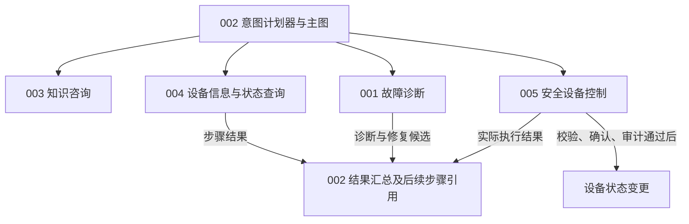

# AutoSense Feature 规格总览

**Updated**: 2026-09-22

004 当前采用 planner 按需调用 DeviceListTool（@Tool）获取设备列表，再依据快照输出 deviceRef；信息查询下沉至 DeviceInfoService，移除固定列表节点和 DeviceInfoTool。提示词中文化，state schemaVersion=3、图版本 assistant-v4，旧图只读。验证见 [工具改造记录](004-user-device-query/planner-tool-validation.md)，此前目标规划验证见 [专项记录](004-user-device-query/planner-target-validation.md)。

AutoSense 提供统一 IoT 自然语言 AI 助手，覆盖知识咨询、本人设备信息与状态查询、故障诊断和安全设备控制。公共基础通过意图计划器生成有序步骤，LangGraph4j 主图负责校验、确定性路由、步骤推进、恢复与结果汇总；AI 负责理解、检索、组织和诊断推理。**基础列表由 planner 按需调用工具获取，普通咨询不查询设备，已有事实足够即直接回答；运行属性查询及设备控制请求必须先取得用户确认；状态变更必须通过确定性的权限检查、参数校验和审计，AI 不得绕过流程。**

本次将原混合规格拆为以下 **5 个 feature**。沿用 `001-iot-auto-diagnosis` 作为诊断目录，新增其余四个目录；编号用于稳定标识，不代表开发顺序。

| Feature | 当前规格 | 边界与交付价值 | 现有成果如何复用 |
| --- | --- | --- | --- |
| 002 公共基础与统一意图计划器 | [spec.md](002-assistant-foundation/spec.md) | 四能力多步计划、确认、重试、幂等、检查点、身份/权限和公共响应 | 复用用户、设备、DTO、会话与 SSE；LangChain4j AI Service 生成计划，LangGraph4j 执行并流式输出 |
| 003 IoT 与设备知识咨询 | [spec.md](003-iot-knowledge-assistant/spec.md) | 解释概念、设备功能、型号与使用方法，说明依据；不读取用户设备实时状态 | 复用直接回答及现有知识内容/检索服务，补齐来源和知识不足处理 |
| 004 用户设备信息与状态查询 | [spec.md](004-user-device-query/spec.md) | 规划前基础信息初始化与直接回答；经完整快照确认的运行属性查询、诊断取证和控制后复检 | 复用绑定、定位、归属检查及客户端/适配器，不由诊断或控制隐式读取 |
| 001 设备故障诊断 | [spec.md](001-iot-auto-diagnosis/spec.md) | 特化知识检索、证据与规则推理、结论/建议、修复候选及售后引导 | 消费独立查询结果，复用分析、规则、知识与售后，节点不访问设备 |
| 005 安全设备控制 | [spec.md](005-safe-device-control/spec.md) | 对直接指令或诊断候选统一校验、确认、互斥执行和审计 | 复用执行器、适配器、锁及日志；前置状态与复检通过独立 004 步骤取得 |

## 依赖与推进顺序

1. **先规划 002**：复用并回归已有基础，明确实际调用的 AI Service 创建、配置和结构化输出；不把新目录存在或已声明接口当作完成重写。
2. **002 的公共契约稳定后，003、004、001、005 可分别规划和验收**。它们依赖共享能力，不必等待其他对话能力全部实现。
3. **002 + 004 + 001 + 005 验收诊断修复闭环**：已声明计划按需包含查询取证、诊断、控制及独立复检查询；每个设备步骤分别确认，主图汇总已有结果。诊断不隐式读写设备，不回跳已完成步骤；控制未启用时保留诊断建议并说明不能执行。
4. 003 和 001 复用当前知识基础；004/005 复用设备定位、客户端及互斥机制，001 消费查询结果。此类复用不要求新建平行台账或相互调用对话入口；先用 stub 跑通公共图骨架，再逐项接入真实能力。

主图控制执行顺序和条件；步骤通过明确结果引用传递事实，复检是独立查询步骤，诊断与控制之间不建立递归调用或回跳。

## 统一边界与首期假设

- **意图**：知识咨询、设备查询、故障诊断、安全控制四类必须区分；意图不明确先澄清，不能默认控制。型号知识属于咨询，明确售后查询属于诊断 feature 的售后引导分支，无需先探测设备。
- **读写**：知识和诊断节点不访问设备；诊断是特化知识检索/推理，取证及复检均为独立查询步骤，控制仅通过独立安全控制步骤。AI 输出不是已通过校验的命令或用户确认。
- **确认**：基础信息初始化及已有事实直接回答免设备确认；运行属性查询和控制请求须明确确认，运行属性确认明确覆盖全部GET及字段范围、能力hash；确认绑定用户、计划、逻辑步骤、设备、操作、参数及有效期。同一步骤内容未变且确认有效时重试/恢复可复用；新步骤、内容变更或过期须重新确认，每次请求仍校验权限和幂等。
- **复合请求**：支持有序多步、条件分支和前序结果引用；每个控制步骤为单设备单动作，运行属性查询为单设备，基础信息集合在规划前一次加载。不动态增删步骤或循环；需要新增步骤时重新生成计划，不继承旧授权。
- **失败与恢复**：仅超时且幂等、确认和预算允许时有限自动重试；明确错误、拒绝或耗尽停止整计划，后续步骤不执行、已完成结果保留且不自动回滚。重启后本人明确请求继续才恢复未终止计划；已成功步骤复用结果，已终止计划不可恢复。
- **知识**：以已有维修知识及提供给项目的设备资料为首期来源，通用概念可直接解释；型号事实和修复方案须检索适用依据，无依据时明确说明，不编造。在线搜索和完整知识运营平台不在首期。
- **设备**：沿用独立 deviceSimulator；智能灯泡 LITE/LA001、LITE/LB001 作为首期实时状态、诊断与控制验收对象。不支持型号仍可绑定、查询稳定信息并进行有依据的知识咨询。
- **兼容**：保留已有账号/角色、SN 全局唯一、用户显示名称、本人设备/会话隔离、长期对话、最近 20 条模型历史与现有流式交互；仅按职责迁移必要类型和调用边界。
- **资料状态**：已有源码、历史已完成任务和验证记录是复用依据，不能证明五项新规格已完成。实际代码缺口与新增验收在各自 plan/tasks 中列出。

2026-09-15 的多步、确认、重试与恢复规则以 002 的五项澄清为准；本次图接入仍处于设计阶段，历史验收不证明新要求已经实现。

## 现有代码归属与重写范围

以下路径均相对于 `src/main/java/com/chh/autosense/`，表示本次检查到的复用入口，不规定未来必须保留每个类名。

| 现有内容 | 所属 feature | 处理方式 |
| --- | --- | --- |
| `controller/UserController`、`AdminUserController`、`service/user`、`core/security` | 002 | 复用并回归；修复相关分层或令牌撤销缺口时按章程处理 |
| `controller/DeviceController`、`core/device/DeviceRegistryService`、设备绑定实体/Mapper | 002 | 保持 SN 绑定、元数据和权限契约，不重新开发一套设备管理 |
| `domain/dto`、`domain/message`、`core/session`、公共响应/异常 | 002 | 保留公共模型、历史查询、事务与租约；旧编排、状态机、上下文续接、能力分发和回调驱动链已删除，graph为唯一执行引擎 |
| `ai/IntentPlannerService`、`ai/factory/IntentPlannerServiceFactory`、`graph/node/PlanValidator` | 002 | AI Service 生成计划，服务端确定性校验与路由；旧分类器、候选和路由装配已删除 |
| `service/knowledge/KnowledgeWorkflowService`、`UserAiServiceCache`、`ai/rag` | 003；检索亦由 001 复用 | 图节点调用直接/增强回答与来源校验；保留用户缓存、专用工厂和共享内存索引；旧handler及能力分发协议已删除 |
| `core/session/DeviceLocator`、`core/device/client`、`adapter`、归属校验 | 002 维护共享能力，004/005 使用，001 消费结果 | 查询及复检经独立确认步骤，不复制客户端或把读取隐藏在诊断/控制中 |
| `core/analysis`、`core/device/rule`、诊断快照/问题报告、`core/aftersales` | 001 | 收敛只读诊断与建议，复用现有规则、知识和人工/售后分支 |
| `core/repair/RepairExecutor`、`core/session/RepairExecutionRunner`、`DeviceLockService`、`RepairActionLog` | 005；设备步骤共享互斥机制 | 复用安全单操作、锁及审计，拆解并删除RepairExecutionRunner；控制和独立查询子图承担流程，诊断不直接操作设备 |

目录规范由[constitution.md](../.specify/memory/constitution.md)统一定义：`ai/factory` 创建 LangChain4j AI Service，`ai/model` 定义 AI 结构化输出，`ai/model/enums` 存放 AI 分类枚举；业务枚举归 `domain/enums`，VO 归 `domain/vo`，全局常量归 `constant`，工具目录为 **`utils`**。

## 原规格需求迁移映射

原编号以[拆分前规格](001-iot-auto-diagnosis/history/20260907-before-feature-split.md)为准。新 feature 的 FR 编号在各文件内独立，不可只凭相同数字判断同一需求。

| 原 FR | 现归属与要求 | 迁移说明 |
| --- | --- | --- |
| FR-001 | 002 FR-001 | 统一自然语言入口 |
| FR-002 | 002 FR-003；001 FR-002 | 通用意图澄清与诊断症状提取分别归属 |
| FR-003 | 001 FR-003；004 FR-003；005 FR-002 | 复用唯一目标定位，不重复建设 |
| FR-004 | 001 FR-004；005 FR-004；004 FR-004/006 | 诊断/控制按支持能力拦截，元数据查询不受诊断白名单限制 |
| FR-005 | 001 FR-005；004 FR-005/008 | 004 经确认采集，001 消费证据，不隐式读取 |
| FR-006 | 001 FR-006 | 规则与诊断推理，不直接控制 |
| FR-007 | 001 FR-007；003 FR-002/009 | 复用维修知识；新增咨询检索职责 |
| FR-008 | 001 FR-008；005 FR-001 至 FR-009 | 诊断移交，控制统一校验/确认/执行 |
| FR-009 | 005 FR-011/014；004 FR-008；001 FR-009 | 独立确认查询承担复检，主图汇总执行与诊断事实 |
| FR-010 | 001 FR-010 | 人工步骤 |
| FR-011 | 001 FR-011 | 售后引导与可靠兜底 |
| FR-012 | 001 FR-012；005 FR-004 | 延续设备扩展约束及允许能力校验 |
| FR-013 | 002 FR-014；001 FR-028；005 FR-012/013 | 公共追溯、诊断证据、控制审计分别承担 |
| FR-014 | 001 FR-014；004 FR-007；005 FR-010/011 | 不可达/失败按能力给出真实结果 |
| FR-015 | 002 FR-009；004 FR-002；001 FR-003；005 FR-003/007 | 公共鉴权及设备使用/执行时校验 |
| FR-016 | 001 FR-016；005 FR-008 | 诊断与控制协调设备互斥 |
| FR-017 | 002 FR-017/020；005 FR-010/011；001 FR-009/010 | 超时有限重试，明确失败/拒绝/耗尽停整计划；复检须独立确认查询 |
| FR-018 | 002 FR-012 | 会话长期保留、20 条历史及新轮次重新路由 |
| FR-019 | 002 FR-001/002/003；003 FR-001/002 | 重写四能力路由，咨询和诊断/控制分离 |
| FR-020 | 002 FR-010/011 | 原 SN 绑定要求全部保留 |
| FR-021 | 002 FR-013 | 公共流式响应和断线补查 |
| FR-022 | 002 FR-008 | 用户注册及资料校验 |
| FR-023 | 002 FR-009 | 既有登录凭证、失效和显式开发模式 |
| FR-024 | 002 FR-008/009 | 当前用户信息和无效身份拒绝 |
| FR-025 | 002 FR-009 | 注销及令牌撤销 |
| FR-026 | 002 FR-009 | 普通用户/管理员及本人资源限制 |
| FR-027 | 002 FR-008/009 | 管理员列表、搜索、禁用/启用 |

原 SC-001/003/004/005 的诊断验收保留并按边界更新；SC-008/009 移入公共基础与各能力权限/绑定验收。原 SC-002、SC-006 的一天接入量化承诺及 SC-007 的运营比例缺少现有统计基线，作为未来量化工作保留说明，不用于判定本次规格拆分或新 feature 已实现。

## 旧设计、任务和验证记录的处理

- [原 spec 完整快照](001-iot-auto-diagnosis/history/20260907-before-feature-split.md)保存本次拆分前的需求及历史澄清；新需求以五份现行 spec 为准。
- 原 001 的 plan、research、data-model、contracts 和 quickstart 保留已有内容，标注为“拆分前参考，待按 feature 重新规划”。用户/设备公共契约可复用；诊断/控制的原混合流程不能原样当作新边界。
- 原 [tasks.md](001-iot-auto-diagnosis/tasks.md)是已完成的 SN 绑定增量任务，保留勾选与实施记录。它不是五个 feature 的新任务清单。
- 原 [单元/契约验证](001-iot-auto-diagnosis/validation/unit-contract.md)及[集成验证](001-iot-auto-diagnosis/validation/integration.md)作为既有成果证据保留，本次文档检查未重跑这些测试。
- 新 feature 的 plan/tasks 应基于当前代码与本次 spec 生成，只列实际缺口和必要回归；不复制旧勾选结果或将所有公共能力当作待从零开发。

## 规格检查与后续入口

本轮仅提出并获得回答 **1 个澄清问题**：诊断生成待确认请求，由安全控制执行并复检。用户随后要求直接按建议拆分并写入文件，后续按已列明的首期假设完成规格。

五份规格均含范围、独立用户故事、验收场景、边界条件、功能要求、实体、成功标准与依赖假设。各目录的 `checklists/requirements.md` 记录规格质量检查；技术约束来自用户明确要求及章程，保留为规划输入，两个“无实现细节”项目如实未勾选，不能据此删除 AI Service 重写要求。

原 001 清单复核结果为 **14/16 → 14/16**，无新增通过或回退，清单正文与勾选均保持不变；新增四份清单各为 **14/16**。未勾选的具体条目为 `No implementation details (languages, frameworks, APIs)` 和 `No implementation details leak into specification`。本次重写范围覆盖规格概述、澄清、用户故事/验收、边界条件、功能要求、实体、成功标准和假设。

规格拆分阶段的文档验证已通过：5 份现行 spec 的必需章节、需求编号唯一性及占位符检查；66 个本地链接；原 27 条需求迁移；旧规格快照与拆分前内容一致；原 tasks 的 26 项已完成记录未变；`git diff --check` 无空白错误。该阶段未运行应用或设备集成测试，也未生成新的实现计划或任务清单。未配置澄清前后扩展钩子。

| 澄清覆盖类别 | 状态 | 本次处理 |
| --- | --- | --- |
| Functional Scope & Behavior | Resolved | 五 feature 的范围、非目标与独立价值 |
| Domain & Data Model | Resolved | 复用实体、轮次/候选/确认/执行关系 |
| Interaction & UX Flow | Resolved | 统一路由、澄清、等待确认与结果回传 |
| Non-Functional Quality Attributes | Deferred | 安全与失败行为已明确；并发容量、各能力时延预算等在 plan 按基线落实 |
| Integration & External Dependencies | Resolved | 公共依赖、外部设备、知识来源及失败处理 |
| Edge Cases & Failure Handling | Resolved | 越权、缺失、重复确认、超时、失败和未知结果 |
| Constraints & Tradeoffs | Clear | AI Service 重写、现有技术与目录约束、优先复用 |
| Terminology & Consistency | Resolved | 区分咨询/查询/诊断/控制及候选/确认/实际结果 |
| Completion Signals | Resolved | 按场景和实际设备调用次数可验收 |
| Misc / Placeholders | Clear | 无未填写的需求占位符 |

## 当前实施状态与历史记录

2026-09-23修复：保留 `@Tool deviceList(String userId)` 与 `.tools(deviceListTool)`，通过调用范围的PlannerInvocationContext把工具结果随PlanProposal写回State，修复设备信息请求因缺失快照自动拒绝的问题；同用户校验、空列表、超时缓存、澄清和恢复均已验证。默认266项测试通过（8项真实模型测试跳过）、相关31项集成通过，详见[修复记录](004-user-device-query/planner-context-validation.md)。未重启业务后端。

2026-09-22实施更新：004已接入独立外部HTTP运行属性实现，原实现更名为DeviceOnlineInfoMockServiceImpl；受信配置选择provider及来源。四型号严格结构校验、字段错误展示、完整确认身份、仅传输超时重试及跨JVM恢复已验证。当前76/79任务完成，默认249项测试、非模拟器83项集成测试、前端构建、两种provider的四型号JAR验证、Mock三组和外部十二组跨JVM场景通过。T047/T051/T078因无可用浏览器保留目视验收待办。配置及脚本参数见[quickstart](004-user-device-query/quickstart.md)，证据见[validation](004-user-device-query/validation.md)；未使用设备模拟器或宣称真实设备实测，未迁移业务数据库、未部署。

2026-09-21实施更新：004已完成规划前本人设备上下文、基础事实直接回答、设备信息Tool及三类四型号结构化Mock、精确型号能力缓存和确认/来源/恢复边界。默认236项测试、全部非模拟器集合57项集成测试、前端构建及最终JAR四型号验收通过。浏览器工具无可用连接，界面目视验收仍待补齐；不将后端通过等同于全部交付完成。详见[任务状态](004-user-device-query/tasks.md)与[验证记录](004-user-device-query/validation.md)。运行属性测试未使用设备模拟器或真实设备，未迁移业务数据库、未部署。以下保留此前规划与实施历史。

2026-09-21分析修订：按用户选择落实C1=A、I1=B、G1=A（每型号可复用结构化对象）、A1=A和U1固定初始化。基础信息足够时直接回答，不生成设备查询或确认；mock仅展示属性；运行属性确认完整GET快照及hash；动态字段和前序引用按型号校验，补齐提示词负向测试。004仍为52项待办、0项实施；相关规格/契约/计划/任务同步，生产代码及设备JSON未改。

2026-09-21任务生成：004的[任务清单](004-user-device-query/tasks.md)包含52项待办（US1 19、US2 19、公共及收尾14），覆盖共享列表、规划前初始化、三类四型号能力缓存、mock运行属性及恢复验收；12项可在各自前置条件完成后分5组并行。MVP为US1及其公共前置任务，当前0项完成。本次仅生成任务并同步文档状态，未实施代码或运行应用测试。

2026-09-20规划完成：004已按设备列表Tool、设备信息Tool、共享页面列表Service、首期mock运行属性、静态JSON能力缓存和规划前设备上下文形成[plan](004-user-device-query/plan.md)、[research](004-user-device-query/research.md)、[data-model](004-user-device-query/data-model.md)、[工具契约](004-user-device-query/contracts/device-tools.md)、[图接入契约](004-user-device-query/contracts/workflow-integration.md)及[验证指南](004-user-device-query/quickstart.md)。本期覆盖三类设备，包含用户本轮已修正的净化器文件；尚未生成实施tasks或修改生产代码。Spec Kit入口为004，实际Git分支为dev。

2026-09-15实施完成：002的[83项任务](002-assistant-foundation/tasks.md)全部完成。LangGraph4j已接管对话计划、人工确认、步骤执行与SSE输出，五类逻辑持久数据已接入，SessionOrchestrator及旧编排专属实现已删除。默认验证205项、包含集成测试的完整验证257项全部通过；三组独立JVM恢复、12个prompt资源的可执行JAR验收及前端构建与界面验收通过，详见[本期验证记录](002-assistant-foundation/validation-langgraph.md)。业务数据库未自动迁移，部署前按[迁移与运行指南](002-assistant-foundation/quickstart.md)操作。外部模型验证采用显式mock与真实SDK代理，未调用真实模型提供商。以下为各阶段的历史记录；004/005新增业务范围仍需独立规划。

2026-09-15任务生成：002的[新任务清单](002-assistant-foundation/tasks.md)包含83项待办（US1 15、US2 5、US3 42、公共及收尾21），覆盖G1–G5、五类数据与旧编排删除。旧59项完成记录（最初56项及3项追加）已原字节归档，本轮未实施新任务。

2026-09-15持久化修订：对话流程按conversation、chat_message、workflow_execution、command_execution、audit_event五类逻辑数据组织。conversation复用repair_session，消息沿用chat_message，audit_event扩展repair_action_log；新增工作流与命令账本，步骤/确认/checkpoint作为工作流内部辅助存储。取消前版新增workflow_event表方案，公开WorkflowEvent仍是DTO。字段/迁移/验收见[数据模型](002-assistant-foundation/data-model.md)，本次仅更新规划。

2026-09-15补充：LangGraph4j迁移完成必须删除SessionOrchestrator和旧编排专属源码、Bean、配置依赖及当前设计，不保留精简门面或回退执行链。002计划新增删除/迁移矩阵、FR-022/SC-011及G5删除验收；003接入说明和005复用边界已同步。旧编排图与早期迁移草案标为历史档案；本轮仅更新规划文档，尚未删除生产代码或重写任务清单。

2026-09-15：002 已按用户指定的 LangGraph4j 主图、分组 state、流式输出及 stub 优先方式完成研究与设计，见[新计划](002-assistant-foundation/plan.md)。五份现行 spec 已同步多步计划、设备查询确认、诊断不隐式读写、有限超时重试和重启后用户恢复边界。001/003 既有 plan/tasks 及历史验证保留，004/005 待独立规划；下方记录均为对应日期的历史结果，不代表新图接入已完成。

2026-09-07：**002-assistant-foundation** 已完成 Phase 0 研究及 Phase 1 设计，见[实施计划](002-assistant-foundation/plan.md)、[研究结论](002-assistant-foundation/research.md)、[数据模型](002-assistant-foundation/data-model.md)和[验证指南](002-assistant-foundation/quickstart.md)，接口与路由契约由计划链接。设计保留六个公共Entity的Lombok调整、现有record兼容和[Log4j 2英文日志契约](002-assistant-foundation/contracts/logging-contract.md)。本轮按章程 **2.3.0** 增加[prompt资源与绑定契约](002-assistant-foundation/contracts/prompt-contract.md)：四个系统资源、两个用户包装、方法级fromResource、本地装配校验、JSON输入编码及真实代理/JAR验收；其他四个feature的范围保持原划分。工程默认超时和并发隔离已明确，不新增未经验证的生产SLA。

该次规划时 Spec Kit 入口为 002，实际 Git 分支为 master；2026-09-15 的 Spec Kit 入口仍为 `002-assistant-foundation`，实际 Git 分支为 `dev`，本次未切换分支。

2026-09-08：**002-assistant-foundation 已完成实施**。[历史任务清单](002-assistant-foundation/history/20260915-before-langgraph-tasks.md) 56 项全部勾选完成；验证证据见[验证记录](002-assistant-foundation/validation.md)：默认 `mvnw.cmd verify` 125 项单元/契约测试通过；显式 -Pit 集成集合（SessionProcessingIT、AssistantRoutingIT、TokenRevocationIT、DeviceLockIT、ConversationHistoryIT、SessionLifecycleIT、AssistantLoggingIT）33 项通过（真实 Testcontainers MySQL/Redis）；runtime/test 依赖树单一 Log4j2 提供者；六个 prompt 资源随 JAR 逐字节验收 PASS；注册/登录/模糊会话/续聊/补查/注销手动链在一次性隔离容器上完成，日志无密码/令牌/prompt 正文。未运行项：模拟器相关 IT（UserManagementIT、DeviceBindingConcurrencyIT 及 ManualGuideIT/AutoRepairFlowIT 的模拟器路径）——外部 deviceSimulator 镜像不可用；真实模型小样本——无凭据，未以 mock 结果冒充真实模型证据。003/004/001/005 四个 feature 的业务处理器尚未接入，公共入口对未注册能力返回 CAPABILITY_NOT_AVAILABLE。
