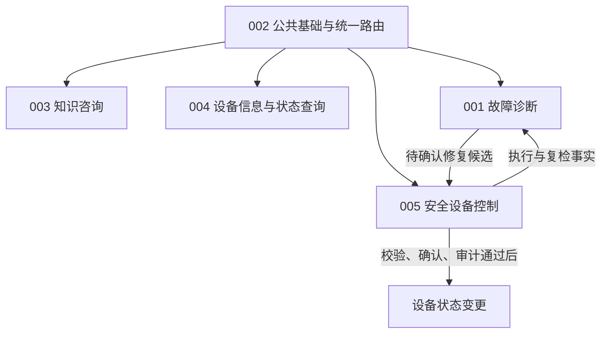

# AutoSense Feature 规格总览

**Updated**: 2026-09-07

AutoSense 提供统一 IoT 自然语言 AI 助手，覆盖知识咨询、本人设备信息与状态查询、故障诊断和安全设备控制。公共基础统一承载身份、设备管理、会话及四能力路由；AI 负责自然语言理解、知识检索、信息组织和诊断推理。**设备状态变更必须经过确定性的权限检查、参数校验、用户确认和审计，AI 不得直接控制设备。**

本次将原混合规格拆为以下 **5 个 feature**。沿用 `001-iot-auto-diagnosis` 作为诊断目录，新增其余四个目录；编号用于稳定标识，不代表开发顺序。

| Feature | 当前规格 | 边界与交付价值 | 现有成果如何复用 |
| --- | --- | --- | --- |
| 002 公共基础与统一路由 | [spec.md](002-assistant-foundation/spec.md) | 统一四能力入口、身份/权限、设备管理、会话与公共响应 | 复用用户控制、SN 绑定、DTO、鉴权、会话、SSE；**Intent Router 与 AI Config 基于 LangChain4j AI Service 重写** |
| 003 IoT 与设备知识咨询 | [spec.md](003-iot-knowledge-assistant/spec.md) | 解释概念、设备功能、型号与使用方法，说明依据；不读取用户设备实时状态 | 复用直接回答及现有知识内容/检索服务，补齐来源和知识不足处理 |
| 004 用户设备信息与状态查询 | [spec.md](004-user-device-query/spec.md) | 自然语言查询本人设备列表、元数据与单台实时状态；只读 | 复用绑定、定位、归属检查、客户端/适配能力，不通过启动诊断来查询 |
| 001 设备故障诊断 | [spec.md](001-iot-auto-diagnosis/spec.md) | 只读证据采集、规则与知识推理、结论/建议、修复候选与售后引导 | 复用分析、规则、维修知识、快照和售后；将设备写职责移交 005 |
| 005 安全设备控制 | [spec.md](005-safe-device-control/spec.md) | 对直接指令或诊断候选统一校验、确认、互斥执行、审计与复检 | 复用设备执行器、适配器、锁及动作日志，补齐安全与幂等边界 |

## 依赖与推进顺序

1. **先规划 002**：复用并回归已有基础，明确实际调用的 AI Service 创建、配置和结构化输出；不把新目录存在或已声明接口当作完成重写。
2. **002 的公共契约稳定后，003、004、001、005 可分别规划和验收**。它们依赖共享能力，不必等待其他对话能力全部实现。
3. **001 + 005 共同验收诊断修复闭环**：001 生成候选并移交，005 重新校验、展示确认、执行、审计和复检，001 根据返回事实组织诊断结论。005 未启用时，001 仍可交付诊断建议并说明无法提交执行。
4. 003 和 001 复用同一现有知识基础；004、001、005 复用设备定位与客户端。此类复用不等于各自入口之间互相调用，也不要求新建平行的用户/设备/知识台账。

图中诊断与控制间的箭头表示业务交接与结果回传，不要求双向代码依赖；具体编排在 plan 中定义并遵守章程的无循环依赖要求。

## 统一边界与首期假设

- **意图**：知识咨询、设备查询、故障诊断、安全控制四类必须区分；意图不明确先澄清，不能默认控制。型号知识属于咨询，明确售后查询属于诊断 feature 的售后引导分支，无需先探测设备。
- **读写**：知识咨询不访问用户设备状态；设备查询与诊断只读，仍须服务端鉴权；AI 输出的动作只是假设/候选，不是已通过校验的命令或用户确认。
- **确认**：全部状态变更都需明确确认；确认绑定具体用户、轮次、请求、设备、动作、参数与有效期，不得跨轮次、改参数或永久复用。
- **复合请求**：首期每轮先明确一项办理事项；控制为单设备单动作、实时查询为单设备。本人设备元数据列表可一次返回多台设备，不提供批量写、定时或条件自动化。
- **知识**：以已有维修知识及提供给项目的设备资料为首期来源，通用概念可直接解释；型号事实和修复方案须检索适用依据，无依据时明确说明，不编造。在线搜索和完整知识运营平台不在首期。
- **设备**：沿用独立 deviceSimulator；智能灯泡 LITE/LA001、LITE/LB001 作为首期实时状态、诊断与控制验收对象。不支持型号仍可绑定、查询稳定信息并进行有依据的知识咨询。
- **兼容**：保留已有账号/角色、SN 全局唯一、用户显示名称、本人设备/会话隔离、长期对话、最近 20 条模型历史与现有流式交互；仅按职责迁移必要类型和调用边界。
- **资料状态**：已有源码、历史已完成任务和验证记录是复用依据，不能证明五项新规格已完成。实际代码缺口与新增验收在各自 plan/tasks 中列出。

上述复合请求和知识来源限制是基于现有范围采用的首期假设，不作为额外向用户确认过的结论；若后续扩展，更新所属 feature 即可。

## 现有代码归属与重写范围

以下路径均相对于 `src/main/java/com/chh/autosense/`，表示本次检查到的复用入口，不规定未来必须保留每个类名。

| 现有内容 | 所属 feature | 处理方式 |
| --- | --- | --- |
| `controller/UserController`、`AdminUserController`、`service/user`、`core/security` | 002 | 复用并回归；修复相关分层或令牌撤销缺口时按章程处理 |
| `controller/DeviceController`、`core/device/DeviceRegistryService`、设备绑定实体/Mapper | 002 | 保持 SN 绑定、元数据和权限契约，不重新开发一套设备管理 |
| `domain/dto`、`domain/message`、`core/session`、公共响应/异常 | 002 | 复用公共模型、会话和流；各能力负责自己的业务状态，按职责补齐共享契约 |
| `core/routing/IntentClassifier`、`domain/enums/Intent`、`config/LangChain4jConfig` | 002 | **重写/调整**：四能力分类、真正接入 AI Service、工厂与结构化输出；原合并的 DEVICE_ACTION 不能继续表示两个能力 |
| `core/routing/DirectAnswerer`、`service/knowledge/RepairKnowledgeService` | 003；知识服务亦由 001 复用 | 接入统一 AI Service，补齐咨询检索、来源和缺失处理；不声称已有完整向量检索 |
| `core/session/DeviceLocator`、`core/device/client`、`adapter`、归属校验 | 002 维护共享能力，004/001/005 使用 | 004 新增自然语言只读查询编排；不复制客户端或把读取绑定到诊断状态机 |
| `core/analysis`、`core/device/rule`、诊断快照/问题报告、`core/aftersales` | 001 | 收敛只读诊断与建议，复用现有规则、知识和人工/售后分支 |
| `core/repair/RepairExecutor`、`core/session/RepairExecutionRunner`、`DeviceLockService`、`RepairActionLog` | 005；锁机制与诊断共享 | 收敛确定性设备写路径、有效确认、并发/重复执行防护及审计 |

目录规范由[constitution.md](../.specify/memory/constitution.md)统一定义：`ai/factory` 创建 LangChain4j AI Service，`ai/model` 定义 AI 结构化输出，`ai/model/enums` 存放 AI 分类枚举；业务枚举归 `domain/enums`，VO 归 `domain/vo`，全局常量归 `constant`，工具目录为 **`utils`**。

## 原规格需求迁移映射

原编号以[拆分前规格](001-iot-auto-diagnosis/history/20260907-before-feature-split.md)为准。新 feature 的 FR 编号在各文件内独立，不可只凭相同数字判断同一需求。

| 原 FR | 现归属与要求 | 迁移说明 |
| --- | --- | --- |
| FR-001 | 002 FR-001 | 统一自然语言入口 |
| FR-002 | 002 FR-003；001 FR-002 | 通用意图澄清与诊断症状提取分别归属 |
| FR-003 | 001 FR-003；004 FR-003；005 FR-002 | 复用唯一目标定位，不重复建设 |
| FR-004 | 001 FR-004；005 FR-004；004 FR-004/006 | 诊断/控制按支持能力拦截，元数据查询不受诊断白名单限制 |
| FR-005 | 001 FR-005；004 FR-005 | 共享只读设备接入，区分诊断证据与查询结果 |
| FR-006 | 001 FR-006 | 规则与诊断推理，不直接控制 |
| FR-007 | 001 FR-007；003 FR-002/009 | 复用维修知识；新增咨询检索职责 |
| FR-008 | 001 FR-008；005 FR-001 至 FR-009 | 诊断移交，控制统一校验/确认/执行 |
| FR-009 | 005 FR-011/014；001 FR-009 | 控制复检并回传事实，诊断组织结论 |
| FR-010 | 001 FR-010 | 人工步骤 |
| FR-011 | 001 FR-011 | 售后引导与可靠兜底 |
| FR-012 | 001 FR-012；005 FR-004 | 延续设备扩展约束及允许能力校验 |
| FR-013 | 002 FR-014；001 FR-028；005 FR-012/013 | 公共追溯、诊断证据、控制审计分别承担 |
| FR-014 | 001 FR-014；004 FR-007；005 FR-010/011 | 不可达/失败按能力给出真实结果 |
| FR-015 | 002 FR-009；004 FR-002；001 FR-003；005 FR-003/007 | 公共鉴权及设备使用/执行时校验 |
| FR-016 | 001 FR-016；005 FR-008 | 诊断与控制协调设备互斥 |
| FR-017 | 005 FR-010/011；001 FR-009/010 | 失败停止、不自动重试、复检并引导 |
| FR-018 | 002 FR-012 | 会话长期保留、20 条历史及新轮次重新路由 |
| FR-019 | 002 FR-001/002/003；003 FR-001/002 | 重写四能力路由，咨询和诊断/控制分离 |
| FR-020 | 002 FR-010/011 | 原 SN 绑定要求全部保留 |
| FR-021 | 002 FR-013 | 公共流式响应和断线补查 |
| FR-022 | 002 FR-008 | 用户注册及资料校验 |
| FR-023 | 002 FR-009 | 既有登录凭证、失效和显式开发模式 |
| FR-024 | 002 FR-008/009 | 当前用户信息和无效身份拒绝 |
| FR-025 | 002 FR-009 | 注销及令牌撤销 |
| FR-026 | 002 FR-009 | 普通用户/管理员及本人资源限制 |
| FR-027 | 002 FR-008/009 | 管理员列表、搜索、禁用/启用 |

原 SC-001/003/004/005 的诊断验收保留并按边界更新；SC-008/009 移入公共基础与各能力权限/绑定验收。原 SC-002、SC-006 的一天接入量化承诺及 SC-007 的运营比例缺少现有统计基线，作为未来量化工作保留说明，不用于判定本次规格拆分或新 feature 已实现。

## 旧设计、任务和验证记录的处理

- [原 spec 完整快照](001-iot-auto-diagnosis/history/20260907-before-feature-split.md)保存本次拆分前的需求及历史澄清；新需求以五份现行 spec 为准。
- 原 001 的 plan、research、data-model、contracts 和 quickstart 保留已有内容，标注为“拆分前参考，待按 feature 重新规划”。用户/设备公共契约可复用；诊断/控制的原混合流程不能原样当作新边界。
- 原 [tasks.md](001-iot-auto-diagnosis/tasks.md)是已完成的 SN 绑定增量任务，保留勾选与实施记录。它不是五个 feature 的新任务清单。
- 原 [单元/契约验证](001-iot-auto-diagnosis/validation/unit-contract.md)及[集成验证](001-iot-auto-diagnosis/validation/integration.md)作为既有成果证据保留，本次文档检查未重跑这些测试。
- 新 feature 的 plan/tasks 应基于当前代码与本次 spec 生成，只列实际缺口和必要回归；不复制旧勾选结果或将所有公共能力当作待从零开发。

## 规格检查与后续入口

本轮仅提出并获得回答 **1 个澄清问题**：诊断生成待确认请求，由安全控制执行并复检。用户随后要求直接按建议拆分并写入文件，后续按已列明的首期假设完成规格。

五份规格均含范围、独立用户故事、验收场景、边界条件、功能要求、实体、成功标准与依赖假设。各目录的 `checklists/requirements.md` 记录规格质量检查；技术约束来自用户明确要求及章程，保留为规划输入，两个“无实现细节”项目如实未勾选，不能据此删除 AI Service 重写要求。

原 001 清单复核结果为 **14/16 → 14/16**，无新增通过或回退，清单正文与勾选均保持不变；新增四份清单各为 **14/16**。未勾选的具体条目为 `No implementation details (languages, frameworks, APIs)` 和 `No implementation details leak into specification`。本次重写范围覆盖规格概述、澄清、用户故事/验收、边界条件、功能要求、实体、成功标准和假设。

规格拆分阶段的文档验证已通过：5 份现行 spec 的必需章节、需求编号唯一性及占位符检查；66 个本地链接；原 27 条需求迁移；旧规格快照与拆分前内容一致；原 tasks 的 26 项已完成记录未变；`git diff --check` 无空白错误。该阶段未运行应用或设备集成测试，也未生成新的实现计划或任务清单。未配置澄清前后扩展钩子。

| 澄清覆盖类别 | 状态 | 本次处理 |
| --- | --- | --- |
| Functional Scope & Behavior | Resolved | 五 feature 的范围、非目标与独立价值 |
| Domain & Data Model | Resolved | 复用实体、轮次/候选/确认/执行关系 |
| Interaction & UX Flow | Resolved | 统一路由、澄清、等待确认与结果回传 |
| Non-Functional Quality Attributes | Deferred | 安全与失败行为已明确；并发容量、各能力时延预算等在 plan 按基线落实 |
| Integration & External Dependencies | Resolved | 公共依赖、外部设备、知识来源及失败处理 |
| Edge Cases & Failure Handling | Resolved | 越权、缺失、重复确认、超时、失败和未知结果 |
| Constraints & Tradeoffs | Clear | AI Service 重写、现有技术与目录约束、优先复用 |
| Terminology & Consistency | Resolved | 区分咨询/查询/诊断/控制及候选/确认/实际结果 |
| Completion Signals | Resolved | 按场景和实际设备调用次数可验收 |
| Misc / Placeholders | Clear | 无未填写的需求占位符 |

## 当前规划状态

2026-09-07：**002-assistant-foundation** 已完成 Phase 0 研究及 Phase 1 设计，见[实施计划](002-assistant-foundation/plan.md)、[研究结论](002-assistant-foundation/research.md)、[数据模型](002-assistant-foundation/data-model.md)和[验证指南](002-assistant-foundation/quickstart.md)，接口与路由契约由计划链接。设计保留六个公共Entity的Lombok调整、现有record兼容和[Log4j 2英文日志契约](002-assistant-foundation/contracts/logging-contract.md)。本轮按章程 **2.3.0** 增加[prompt资源与绑定契约](002-assistant-foundation/contracts/prompt-contract.md)：四个系统资源、两个用户包装、方法级fromResource、本地装配校验、JSON输入编码及真实代理/JAR验收；其他四个feature的范围保持原划分。工程默认超时和并发隔离已明确，不新增未经验证的生产SLA。

当前Spec Kit入口为002，实际Git分支为master。

2026-09-08：**002-assistant-foundation 已完成实施**。[任务清单](002-assistant-foundation/tasks.md) 56 项全部勾选完成；验证证据见[验证记录](002-assistant-foundation/validation.md)：默认 `mvnw.cmd verify` 125 项单元/契约测试通过；显式 -Pit 集成集合（SessionProcessingIT、AssistantRoutingIT、TokenRevocationIT、DeviceLockIT、ConversationHistoryIT、SessionLifecycleIT、AssistantLoggingIT）33 项通过（真实 Testcontainers MySQL/Redis）；runtime/test 依赖树单一 Log4j2 提供者；六个 prompt 资源随 JAR 逐字节验收 PASS；注册/登录/模糊会话/续聊/补查/注销手动链在一次性隔离容器上完成，日志无密码/令牌/prompt 正文。未运行项：模拟器相关 IT（UserManagementIT、DeviceBindingConcurrencyIT 及 ManualGuideIT/AutoRepairFlowIT 的模拟器路径）——外部 deviceSimulator 镜像不可用；真实模型小样本——无凭据，未以 mock 结果冒充真实模型证据。003/004/001/005 四个 feature 的业务处理器尚未接入，公共入口对未注册能力返回 CAPABILITY_NOT_AVAILABLE。
